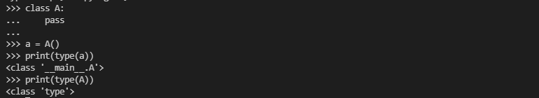
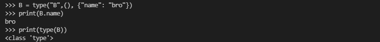
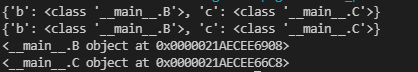

## 背景

最近在实习看代码的时候接触了metaclass相关的知识，查阅了一些资料才感觉有一点点理解，故作此记录。
P.S. 感觉这个特性真99%的情况都不会用到hhh。

## 关于Metaclass


### ```__init__```和```__new__```的区别  

首先，```__new__（cls, *args, **kwargs)```是类的静态方法，在类实例化的时候调用，返回创建的实例。  
而```__init__(self, *args, **kwargs)```是类的实例方法，其参数```self```实际上是```__new__```的返回值。
两个函数中的参数，```cls```一般指类本身，```self```一般指实例化之后的类对象。

### Python的对象(object)

一般来说，在使用Python时遵循定义类——实例化对象这样的范式。如

```python
    class A:
        pass
    # 实例化对象
    a = A()
 ```

但实际上在Python中，类本身也是一个对象，因此可以将其作为函数传参、拷贝、赋值等。如下为类本身与类实例对象调用```type```函数的输出结果。


### 动态创建类

静态的创建类是指预先的在代码中以```class```的形式定义类，而事实上，```type```函数可以动态的创建Python类。调用方法为```type(name, base, attr)```，各个参数的含义为
* ```name```：类名
* ```base```：继承的类
* ```attr```：类的属性，为一个字典。

下图为通过```type```定义的一个例子



### Metaclass

实际上，在我们用```class```定义类的时候，本质上可以理解为调用了```type```函数。```type```函数就是最基本的metaclass，其可以理解为类的类。

我们也可以自己定义一个Metaclass，从而自定义我们的类的生成过程。例如下面的metaclass继承了```type```，并将其所定义的类的属性名改为大写。

 ```Python
# 将类的属性名全部改为大写
class UpperAttrMetaclass(type):
    def __new__(cls, clsname, bases, attrs):
        uppercase_attrs = {
            attr if attr.startswith("__") else attr.upper(): v
            for attr, v in attrs.items()
        }
        return super(UpperAttrMetaclass, cls).__new__(
            cls, clsname, bases, uppercase_attrs)
 ```

在定义类的时候可以通过指定metaclass来定义类的生成过程，这个类可以理解为metaclass的一个实例，并调用metaclass的函数。
```Python
class Foo(object, metaclass=MyMetaclass, kwarg1=value1):
    ...
 ```

## Metaclass的作用

几个例子：

#### 1.将类的属性名全部改为大写

如上所示

#### 2.记录每个类被定义的顺序

```Python
class MyMeta(type):

    counter = 0
    # 这里的cls可以理解为self
    def __init__(cls, name, bases, dic):
        type.__init__(cls, name, bases, dic)
        cls._order = MyMeta.counter
        MyMeta.counter += 1

class MyType(metaclass=MyMeta): 
    pass
```

#### 3.模块化管理

在metaclass中维护一个字典，包含类名和类的对象

```Python
# metaclass定义
class Registar(type):
    def __init__(cls, name, bases, dct):
        if not hasattr(cls, 'registry'):
            cls.registry = {}
        else:
            cls.registry[name.lower()] = cls
        super(Registar, cls).__init__(name, bases, dct)
    def build(cls, key, *args, **kwargs):
        # 实例化对象
        return cls.registry[key.lower()](*args, **kwargs)

# 基类
class A(object, metaclass=Registar):
    alice="a"

class B(A):
    pass
class C(A):
    pass

# 父类是metaclass的一个实例，故可以打印其_registry属性。
# 子类能继承父类的类属性
print(A.registry)
print(B.registry)

# 调用metaclass函数来实例化对应类的对象
o2 = A.build("B")
o3 = A.build("c")
print(o2)
print(o3)
```

运行结果如下，可以看出定义类A相当于Metaclass的一个实例化对象，因此有属性```_registry```。其次，子类可以继承父类的类属性，故类B和C也有属性```registry```。调用Metaclass的```build```函数可以直接实例化对象。



这样做的好处在于，对于一个大型的工程项目，无法预先知道需要实例化的类，定义类的时候相当于对其进行一个注册，实例化的时候可以直接调用基类的build函数，传入conf中的类名即可。此外，基类在字典```regisrty```中是不存在的，避免了对其误调用的错误。
同时，这一模块使得我们在添加模块时无需手动维护一个字典，减少了代码的冗余。

思考：这一模式是否可以通过注册器代替？

## 总结
其实感觉还是没有完全理解真正好用的地方，一些目的好像可以通过其他方式更快的实现，希望在后面的使用过程中可以慢慢理解。

## 参考
* [what-are-metaclasses-in-python](https://stackoverflow.com/questions/100003/what-are-metaclasses-in-python)