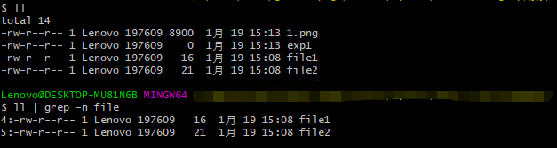

<style> h1 { border-bottom: none } </style>
<style> h2 { border-bottom: none } </style>

<!-- more -->

# 背景

熟悉grep命令能够在shell中实现一些非常方便的功能，因此这里对平时用过的技巧进行总结。  
本篇可能会不定期进行更新: )

# 基础介绍

grep是Linux中一个常用的文本匹配的命令，最常见的形式为

``` Shell
grep [options] pattern file
```

常用的参数定义如下
```
-i : 忽略大小写
-l : 只显示文件名
-n : 显示符合条件的文本行数
-r : 迭代，常用于文件夹的查找
-c : 符合条件的数目
```

正则表达式较为复杂，自己也还没咋搞懂，后续找个时间再学习一下。

# 例子介绍

## 查找文件夹下包含某文本的文件

``` Shell
grep -rn "text" *
```


## 查看符合条件的命令输出

如，使用ll查看文件夹下所有文件且只打印符合条件的文件信息

``` Shell
ll | grep -n "file"
```

