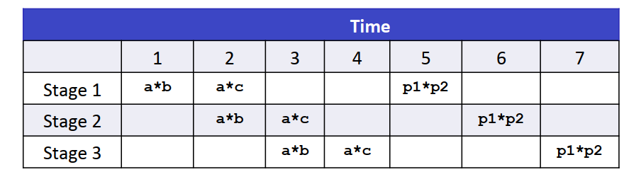
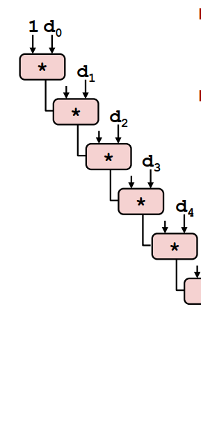
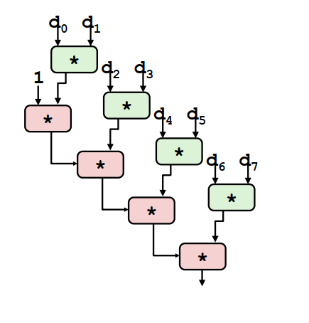
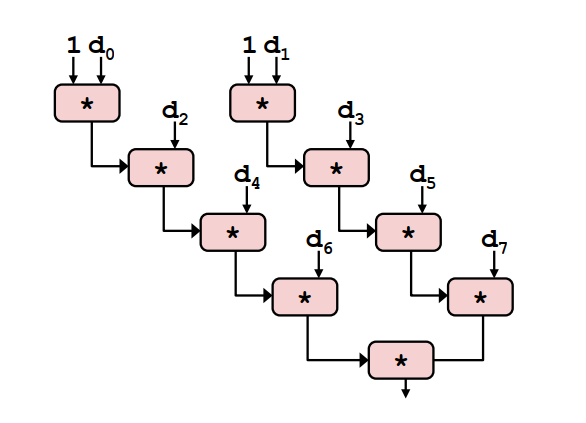

# 背景
本篇内容针对于CSAPP Chapter5的内容整理，主要参考了b站上CMU的网课。
程序优化本身是可以由编译器完成的，如在`gcc -O1`但是编译器进行的优化主要有以下局限性：
* 内存别名的引用
考虑如下两段代码
```C
// code 1
void fun1(long *xp, long *yp){
    *xp += *yp;
    *xp += *yp;
}
```

```C
// code 2
void func2(long *xp, long *yp){
    *xp += 2* *yp;
}
```
如果`xp`与`yp`相同，此时两种代码的执行结果是不同的。因此编译器不会进行这样的优化。
* 编译器不考虑程序之间的相互依赖，如调用系统函数时，编译器可能无法判断调用的函数可能造成后果。

# 程序优化

## 代码移动(code motion)

代码移动指的是将一些诸如在循环中固定不变的计算移到循环外，以下面代码为例：
```C
// 将字符串中的大写字母转成小写。
void lower1(char *s){
    size_t i;
    for (i = 0; i < strlen(s); i++)
        if (s[i] >= 'A' && s[i] <= 'Z')
            s[i] -= ('A' - 'a');
}
```
代码在每次循环时都需要调用一次`strlen`函数，即计算字符串长度，是一个$O(n)$复杂度的操作，因此整个函数的复杂度为$O(n^2)$。因此，可以将`strlen`函数移到循环外，将代码的时间复杂度变为$O(n)$。

## 减少内存引用
减少对内存的直接读写，可以将结果暂存于中间变量之中。
在下面的代码中，代码不断的读取和写入内存中`b[i]`的位置。
```C
// a第i行元素和存到b的第i个元素中
void sum_rows1(double *a, double *b, long n)
{
    long i, j;
    for (i = 0; i < n; i++)
    {
        b[i] = 0;
        for (j = 0; j < n; j++)
            b[i] += a[i*n + j];
    }
}
```
优化版本：
```C
void sum_rows2(double *a, double *b, long n)
{
    long i, j;
    for (i = 0; i < n; i++)
    {
        double val = 0;
        for (j = 0; j < n; j++)
            val += a[i*n + j];
        b[i] = val;
    }
}
```

## 基于处理器的优化

### 基本概念
* CPE: cycles per OP,每个OP所需要的时钟周期，越短越好，可以看成衡量程序性能的指标。
* 延迟(latency)：完成运算所需的总时间
* 发射时间(issue time): 两个连续的同类型的运算之间的最小时钟周期数
* 容量(capacity): 能够执行运算的功能单元的数量，包含运算单元和地址计算单元的最小值
* 吞吐量(throughput)：capacity / issue time
* 处理器的流水线


### 例子
#### 1. 初始代码
```C
// 对向量的所有元素做某个op操作(+或*)
void combine1(vec_ptr v, data_t *dest){
    long i;
    long length = vec_length(v);
    data * d = get_vec_start(v); //找到向量的起始位置
    data_t t = INENT; //结果的初始值，加法为0，乘法为1
    for (i = 0; i < length; i++){
        t = t OP d[i];
    }
    *dest = t;
}
```
#### 2. 循环展开
下面为2x1循环展开的版本：
* 减少循环和条件分支的开销
* 并没有改变OP操作的顺序执行性
```C
// 对向量的所有元素做某个op操作(+或*)
void combine2(vec_ptr v, data_t *dest){
    long i;
    long length = vec_length(v);
    long limit = length - 1;
    data * d = get_vec_start(v); //找到向量的起始位置
    data_t t = INENT; //结果的初始值，加法为0，乘法为1
    // 每次进行两个运算
    for (i = 0; i < limit; i+=2){
        t = (t OP d[i]) OP d[i+1];
    }

    for(; i< length; i++){
        t = t OP d[i];
    }

    *dest = t;
}
```
因此，改进思路应该在于如何利用流水线的特性以及计算单元的个数来提高并行性
#### 3. 改进思路1：循环展开再结合

改变循环体内的语句为
```C
t = t OP (d[i] OP d[i+1]);
```
之前版本和现在版本的示意图如下，可以看到关键路径的长度减小了一半



#### 4. 改进思路2：2x2展开
代码如下
```C
void combine3(vec_ptr v, data_t *dest){
    long i;
    long length = vec_length(v);
    long limit = length - 1;
    data * d = get_vec_start(v); //找到向量的起始位置
    data_t t0 = INENT; //结果的初始值，加法为0，乘法为1
    data_t t1 = INENT; //结果的初始值，加法为0，乘法为1

    // 分别计算偶数位和和奇数位的结果
    for (i = 0; i < limit; i+=2){
        t0 = t0 OP d[i];
        t1 = t1 OP d[i+1];
    }

    for(; i< length; i++){
        t0 = t0 OP d[i];
    }

    *dest = t0 OP t1;
}
```
原理与此类似，且进一步的，可以使更大的$k = C \time L$，使流水线和所有的单元都是满的，从而逼近理论的吞吐量界限。


### 一些限制
* 寄存器的溢出，如并行度太高导致寄存器不够用，需要调用内存时可能反而带来性能的损失。
* 对于条件分支，为了减少由于跳转分支流水线所带来的性能损失，处理器内部会采用称为分支预测的技术。
