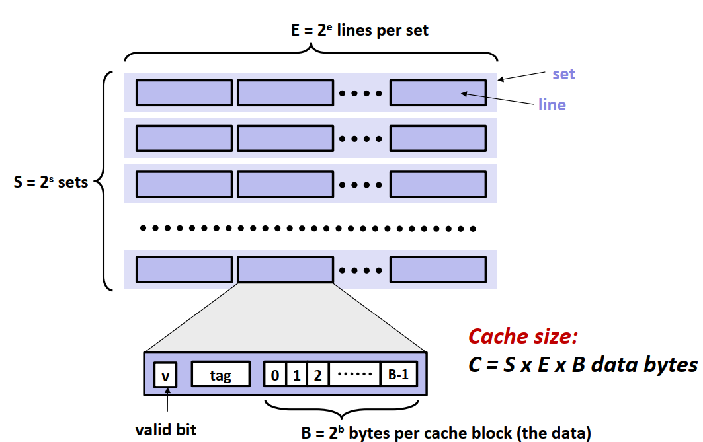
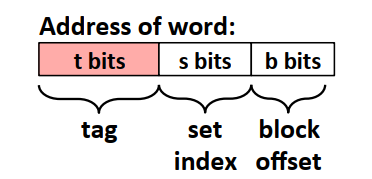
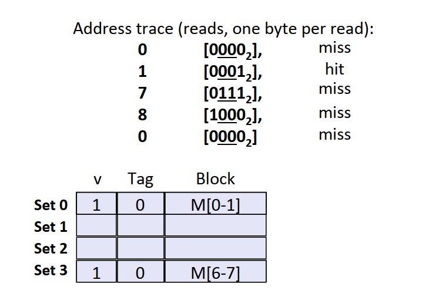
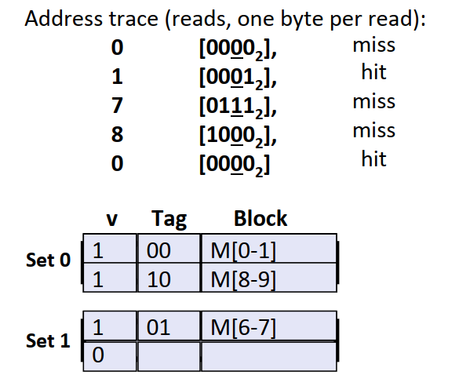
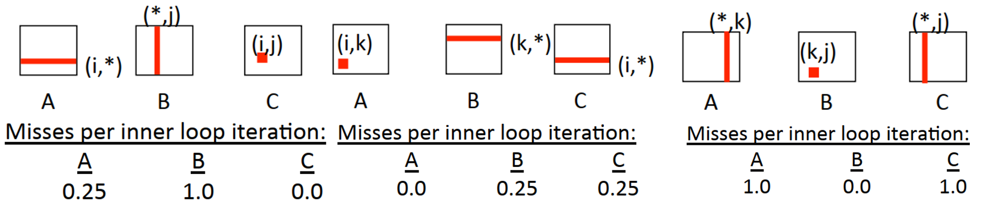
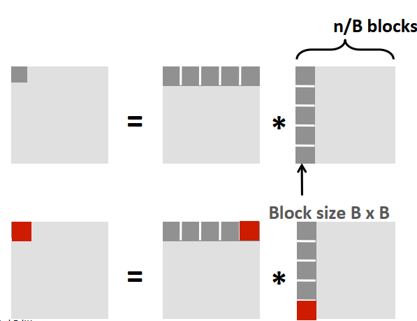

<style> h1 { border-bottom: none } </style>
<style> h2 { border-bottom: none } </style>

<!-- more -->

# 背景

本节是对CSAPP Chapter6内容的整理，同样参考b站课程与书本。
存储器层次结构是一个具有不同容量、成本和访问时间的存储设备的层次结构

# 存储技术相关介绍

## 随机访问存储器(RAM)

包含两种类别：

* SRAM(Static RAM):速度快，主要用于CPU芯片中的高速缓存
* DRAM(Dynamic RAM): 主要用于内存单元
* 两者都是掉电丢失数据

## DRAM

DRAM按照$d\times w$的形式组织，d为超单元个数，有一个二维坐标，w为每个超单元的位数。


## 磁盘存储

### 基本概念

* 盘片(platter)：每个磁盘由若干盘片组成
* 表面(surface)：每个盘片有两个表面
* 磁道(track)：表面上的若干个同心圆
* 扇区(sectors)：每个磁道划分为一组扇区，扇区包含相等的数据，扇区间由间隙(gap)


### 磁盘容量

主要由以下几个指标决定：

* 记录密度(bits/in): 磁道1英寸的段中可以存储的位数
* 磁道密度(tracks/in)：盘片中心一英寸的段内的磁道数目
* 面密度(bits/in2): 上述的平方

存在的问题：如果每个磁道的扇区数目相同，则外围的磁道扇区之间的间隙会越来越大，造成空间的浪费。
改进：对磁道划分记录区，记录区之间的磁道有相同的扇区。。外围的记录区磁道数目更多。
磁盘容量的计算公式为

$$
bytes/sector \times avg.sectors / tracks \\
\times tracks / surface \times surface / platter \times plattter / disk
$$

### 寻找数据

磁盘访问某块数据的过程如下图所示:


可以看到，访问某块数据的时间由三块组成

* 寻道时间：磁头移到对应磁道的时间(9ms)
* 旋转时间：旋转到目标扇区的时间(4ms)
* 传送时间：读写扇区内容的时间(0.02ms)

### 其他

* 磁盘中的磁盘控制器维护着逻辑块号和实际扇区之间的映射表。每个逻辑块可能由B个扇区组成。
* 为什么磁盘的实际容量总是比标着的小:
  * 厂商使用的是$1GB = 10^9 Byter$的计量。
  * 留出备用的扇区填补损坏的扇区。
* CPU访问磁盘的过程：
  * CPU发送请求
  * 磁盘收到命令后直接将内容传送到内存，不需要经过CPU(避免CPU资源的浪费)——直接内存访问
  * 磁盘控制器在数据传送完成后发送中断信号通知CPU。


## 固态硬盘


* 由B个块的序列组成，每个块包含P页。
* 以页为单位写数据(512B-4KB)，每次写入都需要将对应的块擦除
* 固态硬盘有写入次数限制
* 随机读写要比顺序读写速度慢

# 局部性

局部性是指程序应该倾向于引用：1)邻近于最近引用过的数据项的数据。2)最近引用过的数据项本身。包括数据引用和指令本身的局部性。

## 一个简单的例子

下面的两版代码，第一版的效率要高于第二版。这是因为在C语言中，数组是按照行优先的顺序存储的，代码1每次访问元素的间隔为1，而代码2每次访问元素的间隔为N。
```C
// 按行读取
int sumarrayrows(int a[M][N]){
    int i, j, sum=0;
    for(i = 0; i < M; i++){
        for(j = 0; j < N; j++){
            sum += a[i][j];
        }
    }
    return sum
}
// 按列读取
int sumarraycols(int a[M][N]){
    int i, j, sum=0;
    for(j = 0; j < N; j++){
        for(i = 0; i < M; i++){
            sum += a[i][j];
        }
    }
    return sum
}
```

# 存储器层次结构

存储器的层次结构如下图所示

存储器层次结构本质是高层的存储器能够缓存(cache)低层存储器的部分数据，这也是为什么需要注重程序的局部性的原因。不同的层之间以块为大小做传输单元。

* 缓存命中(cache hit)
需要的数据对象d刚好缓存在第k层，则称为缓存命中
* 缓存不命中(cache miss)
  * 需要从第k+1层取出对应数据块。
  * 缓存已满则区域进行替换，有相应的替换算法。
* 缓存不命中的种类
  * 冷不命中：空缓存时造成的不命中
  * 冲突不命中：由于放置策略的限制造成的不命中
  * 容量不命中：工作集的大小超过了缓存的大小。

# 高速缓存存储器

这部分的内容主要是针对处理器中的L1/L2/L3缓存。在分析时为了简化，假设寄存器和内存之间只有一层L1缓存。

## 存储器内部组织结构



如上图，缓存中有S组高速缓存组，每组中有E个缓存行，每个缓存行包含了：1)数据是否有效的有效位。2）标记位标记当前的缓存块信息。3)B字节大小的缓存数据块。
假设内存的地址有m位，则缓存行中标识位的位数为$t=m - s - b$，内存地址的标识则如下图。缓存的**数据**总大小为$C = S \times E \times B$。



## 缓存映射方式
* 整体流程
  * 根据中间s位的组索引确定缓存所在的组
  * 对该组中每一行内存地址的标志位及有效位进行查找，找到符合要求的或确定缓存不命中。
  * 读取数据或者进行行替换
* 直接映射高速缓存(E = 1)：由于组索引的冲突容易不断的加载和驱逐相同的缓存块西，造成冲突不命中。
下图的例子中，$m=4, t=1, s=2, b=1$

* 组相联高速缓存(E > 1): 根据组索引确定组后，需要根据有效位和和标记位确定数据块。

* 全相联高速缓存：一个组包含所有高速缓存行，只适用于小的高速缓存


## 其他tips

* 组索引为什么用中间位而不是高位：
用高位做索引，连续的内存块总是映射到相同的高速缓存块。
* 缓存不命中时行替换的政策：
可以用随机替换政策/LRU(最近最少使用)/LFU(最不常使用)
* 关于写的问题：
写命中(写一个已经缓存的字)：1) 直接写到低一层中。2) 等到该块被驱逐时再写入(需要维护一个标志位表示该块是否被更新过)
写不命中：1) 直接写到低一层中。2) 加载相应的块到缓存中，再根据需要更新。
* 关于缓存性能的评价指标：
  * 不命中率 = 不命中数量 / 引用数量
  * 命中时间： 从缓存传送一个字到CPU所需的时间
  * 不命中处罚：命中时间外所需要的额外时间
  * 99%的hit rate 比97%的hit rate好很多，因为不命中处罚往往比命中时间大很多

## 编写缓存友好的代码

主要原则：
* 对局部变量反复引用：局部变量能够被寄存在寄存器中
* 步长为1的引用模式：如行优先遍历数组

考虑下面的矩阵乘法例子，其时间复杂度为$O(n^3)$，共有$i,j,k$三层循环。不同的循环顺序例子如下：

```C
// i j k
for (i = 0; i < n; i++){
    for (j = 0; j < n; j++){
        sum = 0.0;
        for (k = 0; k < n; k++){
            sum += a[i][k] * b[k][j];
        }
        c[i][j] = sum;
    }
}

// k i j
for (k = 0; k < n; k++){
    for (i = 0; i < n; i++){
        r = a[i][k];
        for (j = 0; j < n; j++){
            c[i][j] += r * b[k][j];
        }
    }
}

// jki
for (j = 0; j < n; j++){
    for (k = 0; k < n; k++){
        r = b[k][j];
        for (i = 0; i < n; i++){
            c[i][j] += a[i][k] * r;
        }
    }
}
```
三种方式的示意图如下。注意后面两种循环顺序相比于第一种多了一步内存访问，这其实是一种内存引用次数和不命中率的trade-off。


进一步可以从时间局部性考虑进行改进，使得相同的块在未来尽可能多的被使用。


不命中率的计算为(假设n/B为整数, B/8为整数)
$$
\begin{gathered}
\text{每个block的不命中次数为}: B/8\times B \\
计算C的一个block总不命中次数为：2\times n/B \times B^2/8 = nB / 4 \\
计算所有block的总不命中次数为: nB / 4 \times n^2 /B^2 = n^3 / 4B  
\end{gathered}
$$