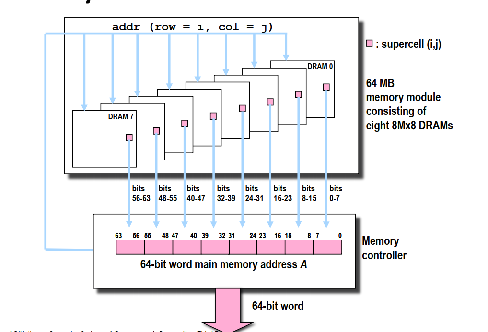
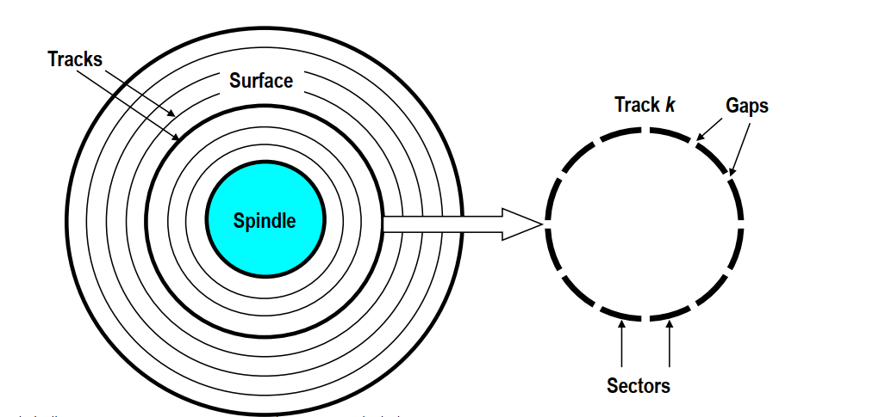
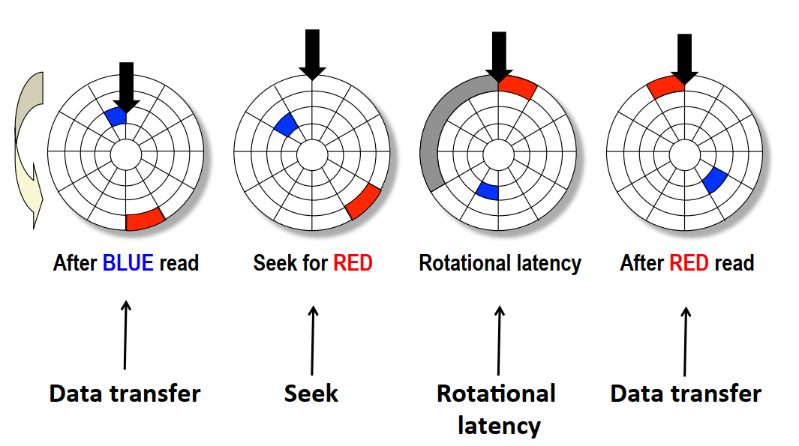
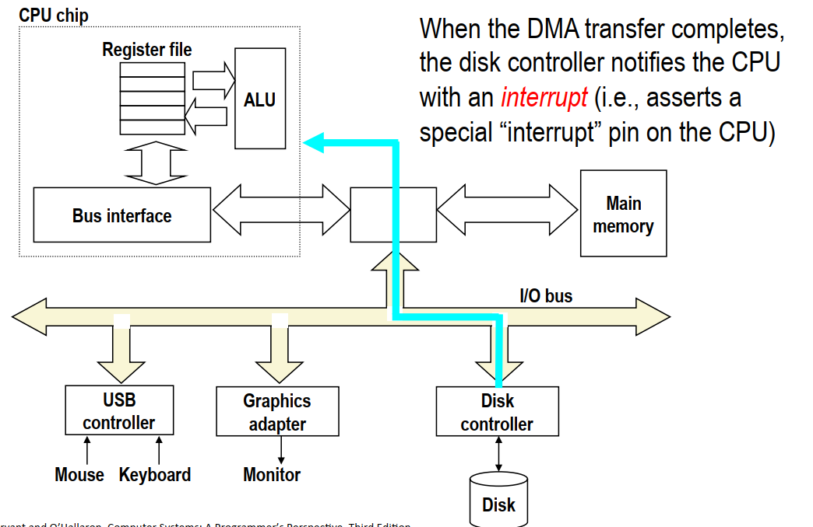
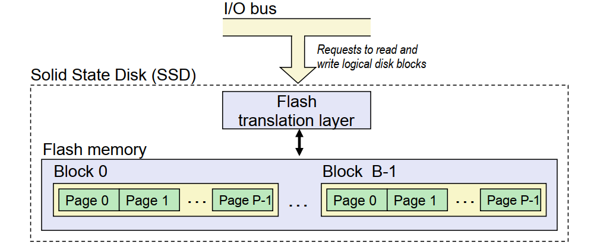
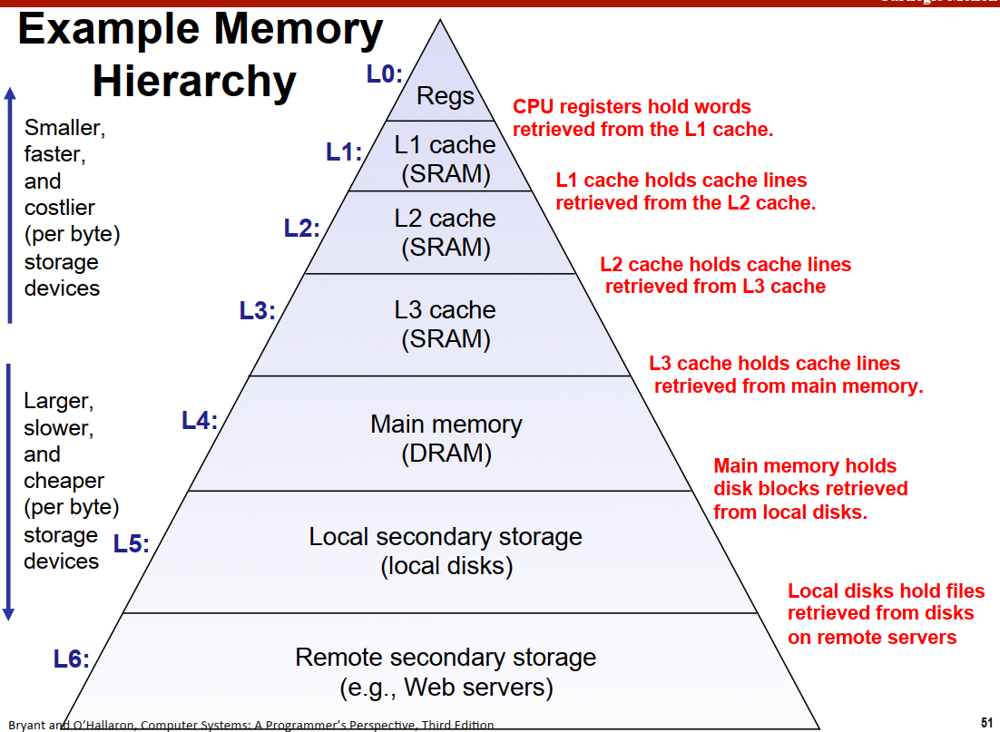

# 背景

本节是对CSAPP Chapter6内容的整理，同样参考b站课程与书本。
存储器层次结构是一个具有不同容量、成本和访问时间的存储设备的层次结构

# 存储技术相关介绍

## 随机访问存储器(RAM)

包含两种类别：
* SRAM(Static RAM):速度快，主要用于CPU芯片中的高速缓存
* DRAM(Dynamic RAM): 主要用于内存单元
* 两者都是掉电丢失数据

## DRAM

DRAM按照$d\times w$的形式组织，d为超单元个数，有一个二维坐标，w为每个超单元的位数。



## 磁盘存储

### 基本概念

* 盘片(platter)：每个磁盘由若干盘片组成
* 表面(surface)：每个盘片有两个表面
* 磁道(track)：表面上的若干个同心圆
* 扇区(sectors)：每个磁道划分为一组扇区，扇区包含相等的数据，扇区间由间隙(gap)


### 磁盘容量

主要由以下几个指标决定：
* 记录密度(bits/in): 磁道1英寸的段中可以存储的位数
* 磁道密度(tracks/in)：盘片中心一英寸的段内的磁道数目
* 面密度(bits/in2): 上述的平方

存在的问题：如果每个磁道的扇区数目相同，则外围的磁道扇区之间的间隙会越来越大，造成空间的浪费。
改进：对磁道划分记录区，记录区之间的磁道有相同的扇区。。外围的记录区磁道数目更多。
磁盘容量的计算公式为

$$
bytes/sector \times avg.sectors / tracks \\
\times tracks / surface \times surface / platter \times plattter / disk
$$

### 寻找数据

磁盘访问某块数据的过程如下图所示:


可以看到，访问某块数据的时间由三块组成
* 寻道时间：磁头移到对应磁道的时间(9ms)
* 旋转时间：旋转到目标扇区的时间(4ms)
* 传送时间：读写扇区内容的时间(0.02ms)

### 其他

* 磁盘中的磁盘控制器维护着逻辑块号和实际扇区之间的映射表。每个逻辑块可能由B个扇区组成。
* 为什么磁盘的实际容量总是比标着的小:
  * 厂商使用的是$1GB = 10^9 Byter$的计量。
  * 留出备用的扇区填补损坏的扇区。
* CPU访问磁盘的过程：
  * CPU发送请求
  * 磁盘收到命令后直接将内容传送到内存，不需要经过CPU(避免CPU资源的浪费)——直接内存访问
  * 磁盘控制器在数据传送完成后发送中断信号通知CPU。


## 固态硬盘



* 由B个块的序列组成，每个块包含P页。
* 以页为单位写数据(512B-4KB)，每次写入都需要将对应的块擦除
* 固态硬盘有写入次数限制
* 随机读写要比顺序读写速度慢

# 局部性

局部性是指程序应该倾向于引用：1)邻近于最近引用过的数据项的数据。2)最近引用过的数据项本身。包括数据引用和指令本身的局部性。

## 一个简单的例子

下面的两版代码，第一版的效率要高于第二版。这是因为在C语言中，数组是按照行优先的顺序存储的，代码1每次访问元素的间隔为1，而代码2每次访问元素的间隔为N。
```C
// 按行读取
int sumarrayrows(int a[M][N]){
    int i, j, sum=0;
    for(i = 0; i < M; i++){
        for(j = 0; j < N; j++){
            sum += a[i][j];
        }
    }
    return sum
}
// 按列读取
int sumarraycols(int a[M][N]){
    int i, j, sum=0;
    for(j = 0; j < N; j++){
        for(i = 0; i < M; i++){
            sum += a[i][j];
        }
    }
    return sum
}
```

# 存储器层次结构

存储器的层次结构如下图所示

存储器层次结构本质是高层的存储器能够缓存(cache)低层存储器的部分数据，这也是为什么需要注重程序的局部性的原因。不同的层之间以块为大小做传输单元。

* 缓存命中(cache hit)
需要的数据对象d刚好缓存在第k层，则称为缓存命中
* 缓存不命中(cache miss)
  * 需要从第k+1层取出对应数据块。
  * 缓存已满则区域进行替换，有相应的替换算法。
* 缓存不命中的种类
  * 冷不命中：空缓存时造成的不命中
  * 冲突不命中：由于放置策略的限制造成的不命中
  * 容量不命中：工作集的大小超过了缓存的大小。