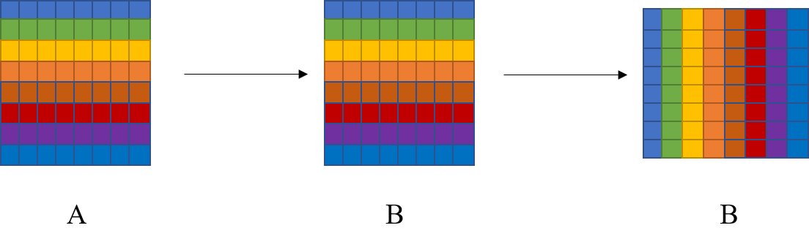
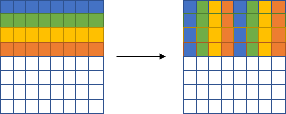
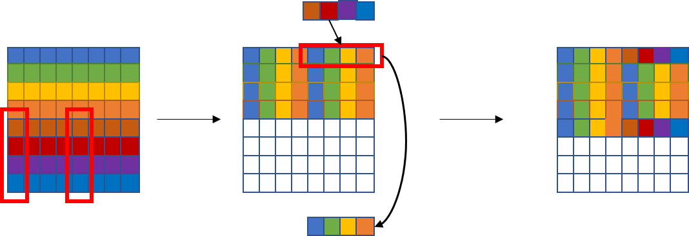

<style> h1 { border-bottom: none } </style>
<style> h2 { border-bottom: none } </style>

<!-- more -->

# Part A: 缓存模拟器

## 要求与注意事项

本部分实验要求实现一个缓存模拟器，根据`.trace`文件的内存访问记录，根据输入的`s, E, b`参数计算缓存命中、不命中、驱逐的次数。
实验中共有6个测试文件，测试时调用`test-csim`可执行程序，自动调用自己编写并编译的`csim`可执行程序进行测试。
实验的要求包括：

* 程序能够处理不同的`s,E,b`参数，这一点使用了C语言的`getopt`实现，后续不再赘述。
* 对于`.trace`文件，`I`表示指令读取，`L`表示数据读取，`S`表示数据存储，`M`表示数据修改，相当于一次读取和一次存储。实验中只需要关注`L, S, M`操作即可。
* 需要修改的代码文件为`csim.c`，其中计算得到`hit, miss, eviction`次数后需要调用`printSummary`函数打印。
* 在缓存块已满进行驱逐的时候，需要实现LRU策略。

## 解答

程序的输入有4个参数

* s: 组索引位数
* E: 每个组的行数
* b: 块偏移位数
* t: 文件名

首先，可以定义一个结构体表示每个缓存块，主要需要包含有效位、标记位和使用时间(LRU策略需要)，如下：

```C
typedef struct 
{
    unsigned int valid_bit; // 有效位
    unsigned int tag_bit; // 标志位
    int last_time; // 时间戳
}Cache;
```

因此，我们需要维护一个二维的缓存数组`cache[S][E]`，其中`S = 1<<s`，缓存数组使用了`malloc`进行动态创建。
对于每一次内存访问，计算得到其对应的组索引和标记`set`和`tag`，计算方式如下：
```C
unsigned int tag = address >> (s + b);
unsigned int set = (address >> b) & (S - 1);
```

接下来就是缓存的更新与命中、不命中、驱逐次数的计算，实验中将其集成在了`update_cache`函数中。缓存的更新分为三步：

### 确定是否缓存命中

这部分需要判断该次内存访问内容是否存在于现有缓存中，主要根据缓存块的`valid_bit = 1`和`tag_bit == tag`两个条件进行判断。此外，对于没有命中但是有内容的缓存块，需要更新其使用时间`last_time`。

```C
int hit_flag = 0;
for(int i = 0; i < E; i++){
    // 只针对有内容的缓存
    if(cache[set][i].valid_bit == 1){
        if(cache[set][i].tag_bit == tag){
            hit += 1;
            cache[set][i].last_time = 0;
            hit_flag = 1;
        }
        else{
            cache[set][i].last_time += 1;            
        }
    }
}
if(hit_flag == 1){
    return;
}
```

### 查找空缓存块

这部分即遍历组索引对应的缓存组，在有空余的缓存块时放入对应内容即可。需要更新变量`miss`。

```C
miss += 1;
// 查找是否有空缓存
for(int i = 0; i < E; i++){
    if(cache[set][i].valid_bit == 0){
        cache[set][i].valid_bit = 1;
        cache[set][i].tag_bit = tag;
        return;
    }
}
```

### 根据LRU算法驱逐和加载块

这部分需要维护`max_time`和`max_time_idx`两个变量，遍历缓存组得到上次使用时间最大的缓存块进行驱逐和替换。
```C
// 根据LRU算法驱逐和加载块
int max_time = MAXTIME;
int max_time_idx = -1;

eviction += 1;
for(int i = 0; i < E; i++){       
    if(cache[set][i].last_time > max_time){
        max_time = cache[set][i].last_time;
        max_time_idx = i;
    }
}
cache[set][max_time_idx].valid_bit = 1;
cache[set][max_time_idx].tag_bit = tag;
cache[set][max_time_idx].last_time = 0;
```

此外，对于不同的操作来说，`S`和`L`在本次实验中是完全一样的。而`M`由于第一次操作必定会使得缓存中有该内存块，因此第二次操作一定会命中。故只需要补充代码：

```C
if(op == 'M'){
    hit += 1;
}
```

# Part B: 矩阵转置

## 要求与注意事项

本部分要求实现矩阵转置的算法，使得缓存不命中的次数尽可能少。
实验需要在`trans.c`代码文件上实现自己的`transpose_submit`函数，并放在字符串描述`transpose_submit_desc`后面才能被正确评测。共需要完成三个尺寸的矩阵转置：`32x32, 64x64, 61x67`

## 解答

本次实验中，假设缓存的参数为`s-5, E=1, b=5`，因此每组缓存可以容纳32字节，即8个int数据大小，一共有32组缓存，相当于可以容纳256字节，即64个int数据大小。

### 32x32

#### 1. 简单方法

显然，传统的矩阵转置算法如下所示，其具有较差的时间局部性。这是因为对于矩阵A来说，其所有元素是按行读取的，在内存位置上是连续的。但是矩阵B的元素是按列读取的，读取`B[8][0]`的时候会与`B[0][0]`有地址冲突，从而驱逐第0行，造成读取`B[0][1]`的时候需要重新加载第0行，大大增加了miss的次数，因此需要对矩阵进行分块处理。

```C
char trans_desc[] = "Simple row-wise scan transpose";
void trans(int M, int N, int A[N][M], int B[M][N])
{
    int i, j, tmp;

    for (i = 0; i < N; i++) {
        for (j = 0; j < M; j++) {
            tmp = A[i][j];
            B[j][i] = tmp;
        }
    }    
}
```
#### 2. 分块策略1.0

根据上述的分析，显然`8x8`是一个较为合适的分块大小。简单的分块代码如下，即每次按8x8的矩阵块完成转置。

```C
char transpose_submit_desc2[] = "Transpose submission 8x8 block";
void transpose_submit2(int M, int N, int A[N][M], int B[M][N])
{
    int i, j, k, l, tmp;
    int block = 8;
    for (i = 0; i < N; i+=block) {
        for (j = 0; j < M; j+=block) {
            for(k = 0; k < block; k++){
                for(l = 0; l < block; l++){
                    tmp = A[i + k][j + l];
                    B[j + l][i + k] = tmp;
                }
            }
        }
    }    
}
```

理论上这种算法可以达到`8x2x16=256`的miss次数，但是由于矩阵A和矩阵B在内存中的地址为(本人电脑实验结果)：`0x6031e0`和`0x6431e0`，可以看出对于表示组索引的部分，两个矩阵是完全相同的。这也意味着在对角块的位置由于两个矩阵的组索引的相同会造成额外的miss。

可以简单计算一下对角块的miss次数：
```
每一块固定的miss次数：8 x 2
第0行：B[0][0]加载后占了A[0][0]的位置，读取A[0][1]时需要重新加载， miss + 1
第1-6行：以第i行为例，上一行存的是A的数据，B[i][i-1]miss + 1；
        读取B[i][i]时是A的数据，miss + 1;
        读取A[i][i+1]时是A的数据，miss + 1;                
第7行：与第1-6行类似，除了不需要再读取A[i][i+1]
```
因此总共的miss次数为
`12x16 + 4x(16+1+3x6+2) = 340`
计算结果为343次，根据[1]的提示，额外的3次为系统的固定操作。

#### 3. 分块策略2.0

因此，需要对对角线的策略进行优化。其中一个想法就是直接一次性取出A每一行的8个元素，寄存在寄存器中。此时对角块的miss次数为`8x2+7=23`,总miss次数为`23x4 + 12x16=284`

```
每一块固定的miss次数：8 x 2
第0行：B[0][0]加载后占了A[0][0]的位置
第1-7行：以第i行为例，上一行存的是B的数据；
        读取B[i][i]时是A的数据，miss + 1;
```

```C
char transpose_submit_desc3[] = "Transpose submission 8x8 block row stored";
void transpose_submit3(int M, int N, int A[N][M], int B[M][N])
{
    int i, j, k;
    int tmp0, tmp1, tmp2, tmp3, tmp4, tmp5, tmp6, tmp7;
    int block = 8;
    for (i = 0; i < N; i+=block) {
        for (j = 0; j < M; j+=block) {
            for(k = 0; k < block; k++){
                tmp0 = A[i + k][j];
                tmp1 = A[i + k][j + 1];
                tmp2 = A[i + k][j + 2];
                tmp3 = A[i + k][j + 3];
                tmp4 = A[i + k][j + 4];
                tmp5 = A[i + k][j + 5];
                tmp6 = A[i + k][j + 6];
                tmp7 = A[i + k][j + 7];

                B[j][i + k] = tmp0;
                B[j + 1][i + k] = tmp1;
                B[j + 2][i + k] = tmp2;
                B[j + 3][i + k] = tmp3;
                B[j + 4][i + k] = tmp4;
                B[j + 5][i + k] = tmp5;
                B[j + 6][i + k] = tmp6;
                B[j + 7][i + k] = tmp7;
            }
        }
    }    
}
```

#### 4. 分块策略2.1

另一种思路则是最后在考虑正对角的元素`A[i][i]`和`B[i][i]`进行特殊化处理，将其放在最后，代码如下：

```C
char transpose_submit_desc4[] = "Transpose submission diag last";
void transpose_submit4(int M, int N, int A[N][M], int B[M][N])
{
    int i, j, k, l, tmp;
    int block = 8;
    for (i = 0; i < N; i+=block) {
        for (j = 0; j < M; j+=block) {
            for(k = 0; k < block; k++){
                for(l = 0; l < block; l++){
                    if(l == k){
                        continue;
                    }
                    tmp = A[i + k][j + l];
                    B[j + l][i + k] = tmp;
                }
                B[j + k][i + k] = A[i + k][j + k];
            }
        }
    }    
}
```

此时对角块的miss次数为`8x2+7=23`,总miss次数为`23x4 + 12x16=284`

```
每一块固定的miss次数：8 x 2
第0行：B[0][0]加载后缓存为B的数据
第1-7行：读取B[i][i]时是A的数据，miss + 1;此时开始下一行的转置，缓存中为B的数据。
```


#### 5. 最终分块策略

上述的版本并没有完全消除冲突，可以采取先复制后转置的策略来完全消除冲突。分为两步：第一步将A的矩阵块复制到B中，第二步对B中的矩阵块进行转置。如下图所示：



```C
char transpose_submit_desc5[] = "Transpose submission copy and transpose";
void transpose_submit5(int M, int N, int A[N][M], int B[M][N])
{
    int i, j, k, l;
    int tmp0, tmp1, tmp2, tmp3, tmp4, tmp5, tmp6, tmp7;
    int block = 8;
    for (i = 0; i < N; i+=block) {
        for (j = 0; j < M; j+=block) {
            for(k = 0, l = 0; k < block; k++, l++){
                tmp0 = A[i + k][j];
                tmp1 = A[i + k][j + 1];
                tmp2 = A[i + k][j + 2];
                tmp3 = A[i + k][j + 3];
                tmp4 = A[i + k][j + 4];
                tmp5 = A[i + k][j + 5];
                tmp6 = A[i + k][j + 6];
                tmp7 = A[i + k][j + 7];

                // 复制到b种
                B[j + l][i] = tmp0;
                B[j + l][i + 1] = tmp1;
                B[j + l][i + 2] = tmp2;
                B[j + l][i + 3] = tmp3;
                B[j + l][i + 4] = tmp4;
                B[j + l][i + 5] = tmp5;
                B[j + l][i + 6] = tmp6;
                B[j + l][i + 7] = tmp7;
            }

            // 缓存中保留的还是B的代码块
            for(k = 0; k < block; k++){
                for(l = k; l < block; l++){
                    tmp0 = B[j + l][i + k];
                    B[j + l][i + k] = B[j + k][i + l];
                    B[j + k][i + l] = tmp0;
                }
            }
        }
    }    
}
```

### 64x64

这个矩阵大小显然不再能够延用上次的策略了，主要原因在于此时每一行需要占用8个缓存块，因此每4行缓存块的索引就会重复。采用`8x8`的分块会造成额外的冲突，而`4x4`的分块又无法充分利用缓存容量。故需要重新调整策略。

首先，由于A是按行取元素，因此是不会有冲突的。B矩阵的前四行则不会有冲突，因此可以先将A的前四行放到B的前4行中，其中左上角的`4x4`方块转置完成，右上角放的实际上是左下角的方块。如图所示，



第二步，我们对B按行填充。每一行的前四个显然为右上角矩阵块的一行，后四个则为A某一列的后四个。此外，我们还需要对B右上角矩阵块进行正确值的填充，显然其每一行为A某一列的后四个。
此外，为了减少不命中次数，我们需要先对右上角矩阵块，即B的前4行完成所有操作后，再进行后4行的操作。



代码如下

```C
char transpose_submit_desc[] = "Transpose submission";
void transpose_submit(int M, int N, int A[N][M], int B[M][N])
{
    int i, j, k, l;
    int tmp0, tmp1, tmp2, tmp3, tmp4, tmp5, tmp6, tmp7;
    int block = 8;
    for (i = 0; i < N; i+=block) {
        for (j = 0; j < M; j+=block) {
            for(k = 0; k < 4; k++){
                tmp0 = A[i + k][j];
                tmp1 = A[i + k][j + 1];
                tmp2 = A[i + k][j + 2];
                tmp3 = A[i + k][j + 3];
                tmp4 = A[i + k][j + 4];
                tmp5 = A[i + k][j + 5];
                tmp6 = A[i + k][j + 6];
                tmp7 = A[i + k][j + 7];

                B[j][i + k] = tmp0;
                B[j + 1][i + k] = tmp1;
                B[j + 2][i + k] = tmp2;
                B[j + 3][i + k] = tmp3;
                
                B[j][i + k + 4] = tmp4;
                B[j + 1][i + k + 4] = tmp5;
                B[j + 2][i + k + 4] = tmp6;
                B[j + 3][i + k + 4] = tmp7;
            }
            for(l = 0; l < 4; l++){

                // 取出右上元素
                tmp0 = B[j + l][i + 4];
                tmp1 = B[j + l][i + 5];
                tmp2 = B[j + l][i + 6];
                tmp3 = B[j + l][i + 7];
                
                // 导入右上元素
                B[j + l][i + 4] = A[i + 4][j + l];
                B[j + l][i + 5] = A[i + 5][j + l];
                B[j + l][i + 6] = A[i + 6][j + l];
                B[j + l][i + 7] = A[i + 7][j + l];

                tmp4 = A[i + 4][j + l + 4];
                tmp5 = A[i + 5][j + l + 4];
                tmp6 = A[i + 6][j + l + 4];
                tmp7 = A[i + 7][j + l + 4];

                // B的下半部分，左下由原来的右上元素补充，右下由A获得
                B[j + l + 4][i] = tmp0;
                B[j + l + 4][i + 1] = tmp1;
                B[j + l + 4][i + 2] = tmp2;
                B[j + l + 4][i + 3] = tmp3;
                B[j + l + 4][i + 4] = tmp4;
                B[j + l + 4][i + 5] = tmp5;
                B[j + l + 4][i + 6] = tmp6;
                B[j + l + 4][i + 7] = tmp7;
            }
        }
    }     
}
```

这种方法其实还有进一步的优化空间，例如对于对角块，用A元素替换B元素的过程中也会产生一定的冲突，例如取`i=j, l=1`，则`B[j+1]`和`A[i+5]`的地址是冲突的，因此导入右上元素时会多出2次miss，导入右下元素时会多出1次miss。这里没有对其进行进一步优化。

### 61x67

这个实验的要求比较松，没太搞明白如何定量的分析缓存块大小与miss次数的关系。因此随便调了个`22x8`的分块大小。

# 参考

* [CSAPP 缓存实验](https://yangtau.me/computer-system/csapp-cache.html#_13)