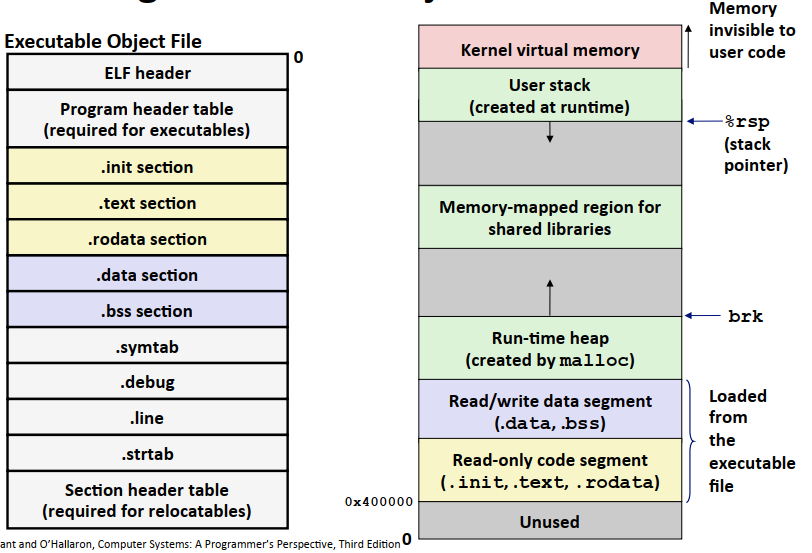

<style> h1 { border-bottom: none } </style>
<style> h2 { border-bottom: none } </style>

<!-- more -->

# 背景

本节是对CSAPP Chapter7内容的整理，同样参考b站课程与书本。
链接的作用包括：

* 模块化管理：将程序解耦为小的源文件，每部分各司其职。
* 效率：一方面，修改一个源文件只需对其编译后重新链接即可，无需重新编译其他源文件；另一方面，不同的程序之间可以共享同样的代码。

## 编译过程

对于我们写的代码，将其转成可执行目标文件主要包含了以下几步：

* 预处理: `x.c`文件转为`x.i`，如读取头文件中的相关内容等
* 编译：将`x.i`文件编译为`x.s`，为一个汇编程序语言
* 汇编：将汇编语言翻译为机器语言指令(二进制)，得到可重定位目标程序(`x.o`)。
* 链接: 将各个代码文件组合得到最后的可执行程序文件。

IDE往往帮助我们完成了上述的所有步骤，得到最后的程序。


## C语言复习相关

### `static`关键字和全局变量

* 在C语言中，`static`关键字既可以用于修饰变量，也可以用于修饰函数。
* 普通的局部变量位于栈空间中，使用完毕后立即释放。而静态变量和全局变量相同，是静态存储方式。
* 静态变量的作用域只位于该文件/该函数中，但是具有持久性。

### 定义和引用

在C语言中，变量或者函数都有定义(define)和引用(reference)过程。

```C
void swap(){} //函数定义

swap(); //函数引用

int *xp = &x; //定义xp，并引用x
```

# 静态链接

静态链接主要包含两个步骤：符号解析与重定位。符号解析将每个符号的引用和一个定义关联。
重定位将汇编器生成的从地址0开始的代码和数据节与内存关联起来，合并得到一个文件。

**注意**: 链接部分不涉及函数内的局部变量。

## 目标文件

目标文件共有三种形式：
* 可重定位目标文件(`.o`)：由编译器和汇编器生成，与其他文件在链接时合并为可执行目标文件。
* 可执行目标文件: 可以直接加载进内存运行的文件。
* 共享目标文件(`.so`)：特殊的可重定位目标文件，可以在链接(静态共享库)时加入目标文件或加载时或运行时(动态共享库)被动态的加载到内存并执行

目标文件的格式为ELF，其中可重定位目标文件的文件格式如下：


各部分的内容如下：

* ELF头：文件系统、字节顺序、文件类型等信息
* Segment header table: 可执行目标文件必须包含
* .text: 机器代码
* .rodata: 只读数据，`printf`的格式串
* .data：初始化的全局变量和静态变量
* .bss：未初始化的全局变量和静态变量，实际上不占据任何空间，只是一个占位符。
* .symtab：符号表，存放程序定义和引用的函数和全局变量信息
* .rel.text：代码的重定位信息。
* .rel.data: 已初始化变量的重定位信息
* .debug：调试符号表
* Section header table: 每个部分的偏移和大小

## 符号表

符号表中包含了三种不同的符号：
* 全局符号(Global Symbols)：由当前模块定义，能被其他模块引用的符号。
* 外部符号(External Symbols)：由其他模块定义，但是在当前模块引用的符号
* 局部符号：只被当前模块定义的static函数和变量。

符号表中每个条目的格式如下
```C
typedef struct{
    int name; // 字符串表的字节偏移，指向符号的以null结尾的字符串名字
    char type;  // 数据or函数，4位
    char binding; // 局部or全局，4位
    char reserved; // 是否被使用
    short section; // 在目标文件中对应的节，如.text,.data, .bss
    long value; // 地址偏移或绝对地址
    long size; // 目标的大小
}
```

三个特殊的伪节：

* UNDEF：在其他地方定义的符号
* ABS：不该被重定位的符号
* COMMON: 未初始化的全局变量/.bss是未初始化的静态变量以及初始化为0的全局或静态变量。

## 符号解析(Symbol resolution)

```C
// main.c
int sum(int *a, int n);

int array[2] = {1, 2}; // 定义array

int main() // 定义全局函数main
{
    int val = sum(array, 2); // 局部变量val，与链接无关
    // sum 和 array全局引用
    
    return val;
}

// -----------------------------------------
// sum.c
int sum(int *a, int n) // 定义全局函数 sum
{
    int i, s = 0;
    for (i = 0; i < n; i++)
        s += a[i];
    
    return s;
}
```

强符号与弱符号:

* 强符号：函数或初始化的变量。
* 弱符号：未初始化的变量

符号解析规则：

* 不允许有多个同名的强符号
* 如果强符号与弱符号同名，则选择强符号
* 如果有多个同名的弱符号，任意选一个

下面为几个重定位中可能出现的一些问题：

```C
//p1.c
int x = 7; 
int main() { 
    p2();
    printf("%d", x)
 } 

// p2.c
int x;
void p2() {
    x = 6;
 }

// output: x = 6。可以看出由于c2的x没有初始化且同名，因此链接器选择了c1中的强符号
```

```C
// p1.c
int x = 1; 
int y = 2;
p1() { ... } 

// p2.c
double x;
p2() { ... }

// 一旦p2中对x改变，由于x是double变量，且链接器选择了c1的强符号，因此y也会被改变。
// 在符号解析阶段，x在符号表中的section是COMMON，
// 因为只有这种情况编译器无法预测链接器使用的是哪一个模块的x定义。
```

编程规范：

* 尽量使用静态变量
* 定义全局变量的时候初始化
* 使用`extern`关键字

## 重定位(Relocation)

在符号解析后，代码中的每个引用都与一个符号表的条目关联，代码节和数据节的大小确定。
而在重定位步骤中，输入模块被合并，为每个符号分配运行地址。下图为重定位的示意图，注意.bss和COMMON部分的变量实际上是占位符，不占用空间，因此在上图中没有体现。


### 重定位条目

由于无法预先知道模块引用的外部函数或全局变量的位置，编译器会生成一个重定位条目(放于.rel.text和.rel.data中)。如下为重定位条目的格式
```C
typedef struct{
    long offset; 
    long type: 32
         symbol: 32;
    long addend;
} ELF64_Rela
```

### 一个例子

对于代码
```C
// main.c
int sum(int *a, int n);

int array[2] = {1, 2}; // 定义array

int main() // 定义全局函数main
{
    int val = sum(array, 2); // 局部变量val，与链接无关
    // sum 和 array全局引用
    
    return val;
}

// -----------------------------------------
// sum.c
int sum(int *a, int n) // 定义全局函数 sum
{
    int i, s = 0;
    for (i = 0; i < n; i++)
        s += a[i];
    
    return s;
}
```

将其反汇编可重定位对象文件可以得到
```
0000000000000000 <main>:
    0: 48 83 ec 08      sub   $0x8, %rsp
    4: be 02 00 00 00   mov   $0x2, %esi 
    9: bf 00 00 00 00   mov   $0x0, %edi  # %edi = &array
                a: R_X86_64_32 array      # Relocation entry
    e: e8 00 00 00 00   callq 13 <main+0x13> # sum()
                f: R_X86_64_PC32 sum-0x4  # Relocation entry
   13: 48 83 c4 08      add   $0x8, %rsp
   17: c3               retq
```

对于`sum`函数，其重定位类型为`R_X86_64_PC32`（相对地址）
```
r.offset = 0xf // 节偏移
r.symbol = sum 
r.type = R_X86_64_PC32
r.addend = -4 // 偏移量
```
计算过程为
```
ADDR(.text) = 0x4004d0 
ADDR(sum) = 0x4004e8 // 已经确定

refaddr = ADDR(s) + r.offsett = 0x4004df // 引用的运行地址

*refptr = (unsigned) (ADDR(r.symbol) + r.addend - refaddr) 
        = (unsigned) (0x4004e8 - 4 -0x4004df) 
        = (unsigned) 0x5
```

对于`array`，其重定位类型为`R_X86_64_32`（绝对地址）
```
r.offset = 0xa // 节偏移
r.symbol = array
r.type = R_X86_64_32
r.addend = 0 // 偏移量
```
计算过程为
```
ADDR(.text) = 0x4004d0 
ADDR(sum) = 0x601018 // 已经确定

refaddr = ADDR(s) + r.offsett = 0x4004da // 引用的运行地址

*refptr = (unsigned) (ADDR(r.symbol) + r.addend) 
        = (unsigned) (0x601018) 
```

因此，在链接完成后的反编译得到的汇编代码为
```
00000000004004d0 <main>:
    4004d0: 48 83 ec 08      sub   $0x8, %rsp
    4004d4: be 02 00 00 00   mov   $0x2, %esi 
    4004d9: bf 18 10 60 00   mov   $0x0, %edi  # %edi = &array
    4004de: e8 05 00 00 00   callq 4004e8 <sum> # sum()
    4004e3: 48 83 c4 08      add   $0x8, %rsp
    4004e7: c3               retq 

00000000004004e8 <sum>:
    4004e8: b8 00 00 00 00   mov   $0x0, %eax
    ...
    ...
    400501: f3 c3            repz retq
```

一些问题：注意，重定位条目是不知道引用位置的文件生成的。
如果多次引用是否每次引用都会有一个重定位条目？
未初始化的全局变量位置？


最终合成的可执行目标文件的内存示意图如下


# 链接库

在开发过程中，部分代码在不同的程序中有着很高的出现频率。因此，编译系统提供了库的概念。

## 静态库

静态库可以作为链接的输入，当输出可执行文件时，只复制静态库内被应用程序引用的目标模块，节省代码空间。

以下面的例子为例：
```C
// main.c
#include <stdio.h>
#include "vector.h"

int x[2] = {1, 2};
int y[2] = {3, 4};
int z[2];

int main()
{
    addvec(x, y, z, 2);
    printf("z = [%d %d]\n", z[0], z[1]);
    return 0;
}

// -----------------------------------------
// addvec.c
void addvec(int *x, int *y, int *z, int n)
{
    int i;
    for (i = 0; i < n; i++)
        z[i] = x[i] + y[i];
}

// -----------------------------------------
// multvec.c
void multvec(int *x, int *y, int *z, int n)
{
    int i;
    for (i = 0; i < n; i++)
        z[i] = x[i] * y[i];
}
```

主函数中引用了`addvec`函数，因此链接器会预先寻找我们创建的静态库，示意图如下


链接器解析外部引用的步骤为：

* 扫描所有`.o` 和 `.a `文件，维护中当前未解析引用的列表U,已定义的符号集合D和可重定位目标文件集合E。
* 根据扫描到的文件时，试图去寻找未解析引用的定义，更新U,D,E。丢弃不包含在E中的文件。
* 如果扫描结束时U非空，则报错。

这一做法的问题是`gcc`的时候，顺序变得非常重要，因为未被引用的文件会被丢弃。例如，假设`foo.c`调用`libx.a, libz.a`，而这两个库又调用`liby.a`，则顺序必须为
```
gcc foo.c libx.a libz.a liby.a
```

## 共享库

静态库具有以下的缺点：

* 每个可秩执行程序都有`printf`或`scanf`的代码段，造成内存的浪费。
* 静态库的更新需要重新链接。

共享库则不需要程序复制代码段，只复制了共享库的重定位和符号表信息，在程序运行时进行解析对库的使用。共享库的示意图如下


# 总结

链接这部分感觉学的似懂非懂，书上介绍的也都是比较简单的例子。后面如果有用的话可能还要进一步阅读。包括库打桩技术也只是了解了一个皮毛，故这里暂时没有进行记录。