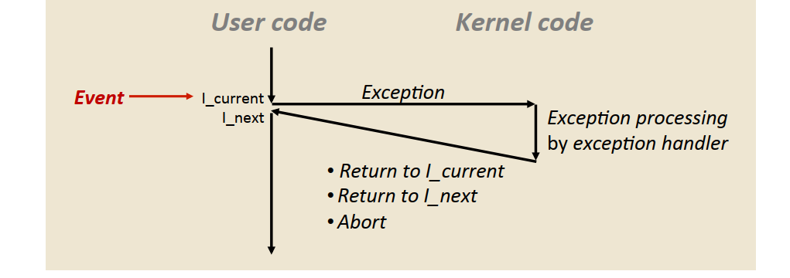
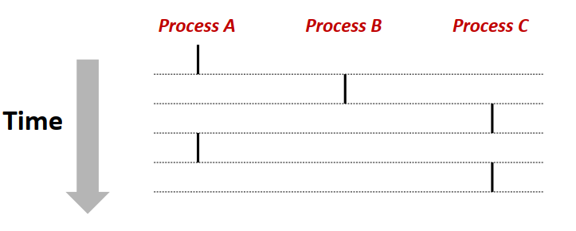
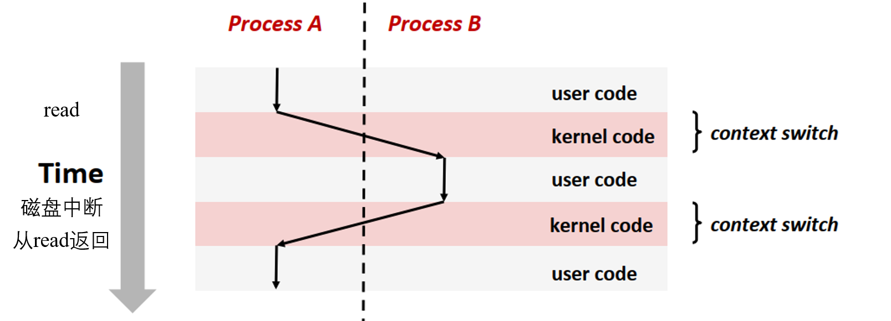
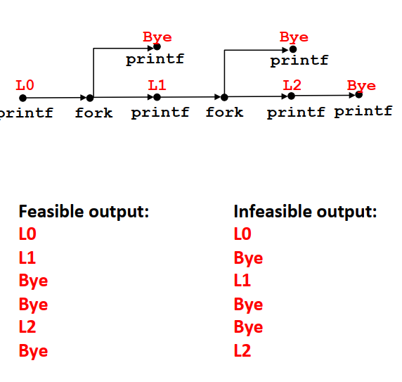
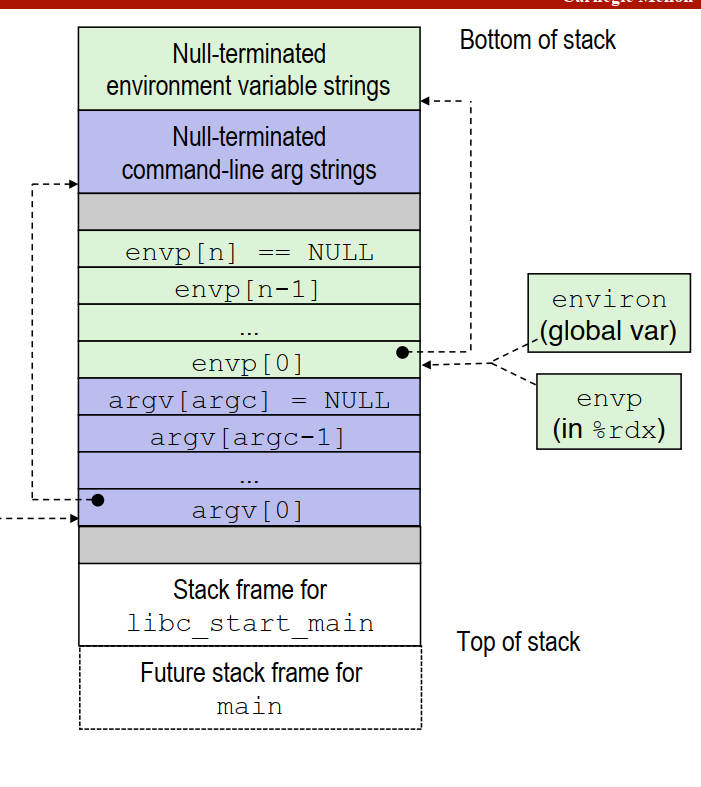

<style> h1 { border-bottom: none } </style>
<style> h2 { border-bottom: none } </style>

<!-- more -->

# 背景

本节是对CSAPP Chapter8内容的整理，同样参考b站课程与书本。
程序中的控制指令在执行过程中大部分都是在内存相邻的指令，而不相邻的指令往往通过两种方式实现:1) 跳转和分支。2) 调用和返回。但这两种方法都是针对于内部程序状态变化的反应。
在某些情况下，如系统计时器、外部IO的中断信号、指令除以0等，需要能够对系统状态的变化做出反应，这就是异常控制流(Exceptional Control Flow, ECF)。注意，这里的异常控制流不是狭义上所认为的`try catch`语句。
ECF处于计算机系统的各个层次中，包括了异常处理，上下文进程切换，信号和非本地跳转，后面将对这四种机制进行介绍。


# 异常

异常的流程示意图如下，其中状态的变化称为事件。**操作系统**和**处理器**为每类异常分配了唯一的非负整数的异常号，前者包括I/O设备的信号，系统调用；后者包括被0除，内存访问违例等。



异常和过程调用的区别在于

* 过程调用需要将返回地址压入栈中。而异常的返回地址要么是当前指令，要么是下一条指令。
* 异常处理程序运行在内核模式中，即对所有的系统资源有完全的访问权限。

## 异常的类别

* 中断：异步异常，不是由任何一条专门的指令造成，而是来自外部的I/O设备信号，处理程序返回**下一条指令**。
* 陷阱：同步异常，异常处理后返回至**下一条指令**。常见的诸如系统调用(syscall)，包括`read, fork, execve, exit`
* 故障：由错误情况引起，可能被修正并重新执行**当前指令**，也可能被终止。
* 终止：不可恢复的致命错误，如硬件错误，直接终止程序。

# 进程与进程控制

异常是允许操作系统内核提供进程的基本构造，每个进程在系统中拥有

* 独立的逻辑控制流，使得进程看起来独自使用处理器（基于上下文切换）
* 私有的地址空间，使得进程看起来独自使用内存系统（基于虚拟内存）

## 并发流

一个逻辑流的执行在时间上与另一个重叠，则称为并发流。如下图，进程A与B，进程A与C称为并发流，但是进程B与C则不是。



## 上下文切换

上下文(context)是内核为每个进程维持的状态，包括寄存器、程序计数器、用户栈、内核栈等。内核对进程进行调度，在切换进程时需要：1) 保存当前进程的上下文。2) 恢复新进程的上下文。3）将控制传递给新进程。
下图为进程A和B进行上下文切换的实例，进程A执行系统调用后引发异常处理程序，异常处理程序请求磁盘数据传输，并切换到进程B。执行进程B时接收到系统的磁盘中断后，再切换回进程A。



## 进程控制

### 获取进程ID

`getpid`：返回调用进程的PID
`getppid`：返回调用进程父进程的PID

### 终止进程

进程所处的状态有三种：

* 运行：进程正在执行，或者等待被执行。
* 停止：进程的执行被挂起，此时进程不会被调度。
* 终止：进程永久的停止。

进程可能因为三种情况而终止：

* 收到一个终止信号
* 主程序的返回
* `exit`函数

```C
void exit(int status) // status表示退出状态
```

### 创建进程

`fork`函数创建一个子进程，两个进程拥有不同的PID，但子进程的用户级虚拟地址空间是父进程的一个副本，共享文件（如读取或输出打印）。
`fork`函数被调用一次，但返回两次。父进程中返回子进程的PID, 子进程中则返回0。两个进程是并发执行的独立进程。
对于调用`fork`函数后的语句执行和输出顺序，可以用流程图的方式进行展现，以下为一个例子
```C
void fork(){
    printf("L0\n");
    if(fork() != 0){
        printf("L1\n");
        if(fork() != 0){
            printf("L2\n");
        }
    }
    printf("Bye\n");
}
```
该函数的执行流程图和可能的输出如下：


### 子进程回收

进程**终止**后，不会被内核从系统中清除，而是等待父进程的回收。如果父进程已经终止，则会被`init`进程回收。终止了但未被回收的进程称为僵死进程，它们仍然消耗系统的内存资源。
可以调用`wait`或者`waitpid`来回收子进程

```C
//  pid: pid > 0表示等待指定的子进程， pid=-1表示等待任意的子进程
// statusp: 表示子进程的返回状态信息
// options: 默认为有子进程终止即返回，可以修改
// 返回对应的子进程PID，无子进程返回-1
pid_t waitpid(pid_t pid, int *statusp, int options)
pid_t wait(int *statusp) // 等价于 waitpid(-1, &status, 0)
```

下面的代码按照进程创建的顺序回收僵死的子进程

```C
int main(){
    pid_t pid[N], retpid;
    int i, status;

    // 创建子进程
    for(i = 0; i < N; i++){
        if((pid[i] = fork()) == 0) // 子进程
            exit(100 + i);
    }

    // 回收子进程
    while((retpid = waitpid(pid[i++], &status, 0)) > 0){
        if (WIFEXITED(child_status))
            printf("Child %d terminated normally with exit status=%d\n",
                    retpid, WEXITSTATUS(status));
        else
            printf("child %d terminated abnormally \n", retpid);

    }

    // 若没有子进程设置errno为ECHILD
    if (errno != ECHILD){
        // 错误信息
    }

    exit(0);
}
```


### 加载并运行程序

`exceve`函数可以在当前进程的上下文中运行一个新程序，只有出现错误时才会返回原来的程序。如果正常执行，新的程序会覆盖当前的地址空间，继承文件描述符并维持PID不变。
```C
// argv[0] 是filename
// char * argv[] 表示一个字符串数组，每个元素为一个指针，指向字符串
int exceve(const char *filename, const char *argv[], const char *envp[]);
```


# 信号

信号是系统中一种更高层次的软件异常，允许内核和进程中断其他进程。信号一个常见的用途是，对于Shell程序，如果子进程在后台运行，那么我们就不会使用`waitpid`等待其结束后再回收，因此可以在其结束后发送信号给父进程，通知父进程进行回收。
Linux系统中常见的信号如下：

| 序号 | 名称 | 默认行为 | 事件 |
| :---: | :---: | :---: | :---:|
|2 | SIGINT | 终止 | 键盘ctrl + C |
|9| SIGKILL | 终止 | 杀死程序|
|10| SIGUSR1 | 终止 | 用户定义的信号1|
|11| SIGSEGV | 终止 | 无效的内存引用 |
|12| SIGUSR2 | 终止 | 用户定义的信号2 |
|14| SIGALRM | 终止 | 计时器的信号 |
|17| SIGCHLD| 忽略 | 子进程停止或终止 |
|20| SIGSTP | 停止直到SIGCONT信号 | 终端的停止信号|

## 信号的术语

### 发送信号

发送信号给目的进程可以通过更新目的进程上下文中的状态实现。发送信号的原因包括：1) 内核检测到一个系统事件。 2) 一个进程调用了`kill`函数。进程可以发送信号给自身。
发送信号的机制主要是基于进程组的概念实现的。默认情况下，子进程和父进程同属一个进程组，可以通过`setpgid`函数改变进程组，`getpgrp`函数得到进程组ID。
常见的发送信号方式包括，注意`kill`函数并不是想象中的杀死进程，而是发送信号，只有`kill -9`（发送SIGKILL信号）才会杀死进程。

```Shell
kill -9 xxx # 发送SIGKILL信号给对应进程
kill -9 -xxx # 发送SIGKILL信号给对应进程组里的所有进程
Ctrl + C # 发送SIGINT信号到前台进程的进程组
Ctrl + D # 发送SIGTSTP信号到前台进程的进程组，挂起前台作业，可以使用fg命令重新启动
```

```C
// kill函数：发送信号给其他进程
int kill(pid_t pid, int sig)
// pid=0, 当前进程及其进程组的所有进程
// pid<0, 对应进程的进程组
// pid>0， 对应进程

int main(){
    pid_t pid;

    if((pid=fork()) == 0){
        pause(); // pause函数：wait for signal to arrive
        printf("control should never reach here\n");
        exit(0);
    }

    kill(pid, SIGKILL); // 发送信号
    exit(0);
}
```

### 接收信号

目的进程对信号做出反应称为接收信号。主要的处理方式包括：1)忽略信号。2)终止进程。3)执行信号处理程序。
当内核从系统调用返回或完成上下文切换后，准备切换回用户模型时，内核会检查待切换进程**未被阻塞**的**待处理**的信号集合(pending & ~ blocked)，每个信号都要被处理才能返回待切换进程的下一条指令。
每个信号有默认的行为，如下：

* 进程终止
* 进程终止并转储内存
* 进程停止直到被SIGCONT信号重启
* 进程忽略该信号

此外，可以通过`signal`函数修改默认行为，但是SIGSTOP信号和SIGKILL信号的默认行为是不能被修改的。此外，在信号处理程序中可以被其他信号中断，但是不能被同一种信号中断！

```C
sighandler_t signal(int signum, sighandler_t handler)
```

下面的例子设置了SIGINT信号的信号处理程序，使进程退出前打印输出
```C
void sigint_handler(int sig) // SIGINT 处理器
{
    printf("Caught SIGINT \n");
    exit(0);
}

int main()
{
    // set SIGINT handler
    if (signal(SIGINT, sigint_handler) == SIG_ERR)
        unix_error("signal error");
        
    // wait for signal
    pause();
    return 0;
}
```

### 待处理信号

发出但还未被接收的信号称为待处理信号。**一种类型至多有一个待处理信号**，后面的待处理信号会被直接**丢弃**（疯狂按`CTRL + C`是没用的)。内核中有一个`pending`向量维护着待处理信号的集合，可以将其理解为一个one-hot向量。

### 阻塞信号

一种信号被阻塞后，目的进程不会对该类型的待处理信号进行接收。但进程取消对该信号类型的阻塞后，可以处理之前的待处理信号。同样，内核中有一个`blocked`向量维护着被阻塞的信号集合。
隐式阻塞机制：内核默认阻塞当前处理程序正在处理信号类型的待处理信号，信号处理程序结束后再对其进行处理。
显式阻塞机制：明确地阻塞和解除选定的信号。主要的函数如下

```C
sigset_t mask, prev_mask;

sigemptyset(&mask); // 初始化mask为空
sigaddset(&mask, SIGINT); // 把 SIGINT 信号加入mask中
sigdelset(&mask, SIGINT); // 把 SIGINT删除

// 阻塞信号，并保存之前的集合作为备份
sigprocmask(SIG_BLOCK, &mask, &prev_mask);
// 取消阻塞，恢复原来的状态
Sigprocmask(SIG_SETMASK, &prev_mask, NULL);
```

## 关于信号处理函数

如何编写安全的信号处理函数涉及到Unix编程，这里不过多涉及。
**异步信号安全**：1) 不会被信号中断的函数。2)只访问局部变量。常见的`printf, malloc, exit`不包含在这之中。

### 信号是不会排队的

下面的函数希望实现父进程创建并回收子进程，避免留下僵死进程，而在其他时候能够自由工作的功能。

```C
void handler1(int sig){
    int olderrno = errno;

    if((waitpid(-1, NULL, 0)) < 0){
        sio_error("waitpid_error"); // 异步信号安全的错误信息打印函数
    }

    Sio_puts("Handler reaped child\n"); // 输出
    Sleep(1);
    errno = olderrno;
}

int main(){
    int i, n;
    
    signal(SIGCHLD, handler1);
    for(i = 0; i < 3; i++){
        if(fork() == 0){
            printf("hello from child %d \n", (int)getpid());
            exit(0);
        }
    }

    while (1)
        ;
    exit(0);
}
```

上面的实现可能由于子进程结束过快，子进程i的SIGCHLD信号到达时已有子进程的SIGCHLD信号，导致其信号丢失，从而导致子进程i永远不会被回收。下面的版本则通过在handler中等待所有子进程返回并回收解决这一问题

```C
void handler2(int sig){
    int olderrno = errno;

    while((waitpid(-1, NULL, 0)) > 0){
        Sio_puts("Handler reaped child\n"); // 输出
    }
    if (errno != ECHLD)
        sio_error("waitpid_error"); // 异步信号安全的错误信息打印函数
    Sleep(1);
    errno = olderrno;
}
```

### 并发错误

子进程和父进程执行顺序的不确定性可能使得程序不能按照我们想要的效果被执行。考虑如下程序，

```C
void handler(int sig){
    sigset_t mask_all, prev_all;
    pid_t pid;

    sigfillset(&mask_all);

    while((pid = waitpid(-1, NULL, 0)) > 0){
        sigprocmask(SIG_BLOCK, &mask_all, &prev_all); //阻塞所有信号，避免被中断
        deletejob(pid);
        sigprocmask(SIG_SETMASK, &prev_all, NULL);
    }
}

int main(int argc, char ** argv){
    sigset_t mask_all, prev_all;
    pid_t pid;

    sigfillset(&mask_all);

    signal(SIGCHLD, handler);
    initjobs(); // initialize job list

    while(1){
        if((pid = fork()) == 0){
            exceve("/bin/date", argv, NULL);
        }

        sigprocmask(SIG_BLOCK, &mask_all, &prev_all); // 阻塞所有信号，避免被中断
        addjob(pid);
        sigprocmask(SIG_SETMASK, &prev_all, NULL);
    }
}
```
该程序希望实现的功能是：父进程创建子进程后将其加入作业列表；在信号处理程序中回收子进程时，将其从作业列表删除。
这个代码的问题在于，有可能执行`addjob`之前，子进程就已经执行完毕并返回SIGCHLD信号，从而触发信号处理函数调用`deletejob`。最后导致列表中存在无法被删除的进程号。要想解决这个问题，我们应该避免调用`addjob`之前处理SIGCHLD信号，因此修改代码如下：

```C
int main(int argc, char ** argv){
    sigset_t mask_all, prev_all, mask_one;
    pid_t pid;

    sigfillset(&mask_all);
    sigemptyset(&mask_one);
    sigaddset(&mask_one, SIGCHLD);

    signal(SIGCHLD, handler);
    initjobs(); // initialize job list

    while(1){
        sigprocmask(SIG_BLOCK, &mask_one, &prev_all); // 阻塞SIGCHLD信号
        if((pid = fork()) == 0){
            sigprocmask(SIG_SETMASK, &prev_all, NULL); // 子进程会继承父进程的阻塞状态
            exceve("/bin/date", argv, NULL);
        }

        sigprocmask(SIG_BLOCK, &mask_all, &prev_all); // 阻塞所有信号，避免被中断
        addjob(pid);
        sigprocmask(SIG_SETMASK, &prev_all, NULL);
    }
}
```

### 等待信号
主程序有时候需要显式等待信号处理程序的运行。如需要判断子进程完成后才能继续执行程序，代码如下：
```C
volatile sig_atmoic_t pid; // 存在内存中的标志

void handler(int sig){
    pid = waitpid(-1, NULL, 0);
}

int main(int argc, char ** argv){
    sigset_t mask_all, prev_all;
    pid_t pid;

    signal(SIGCHLD, handler);
    signal(SIGINT, handler);

    sigemptyset(&mask_all);
    sigaddset(&mask_all, SIGCHLD);

    while(1){
        sigprocmask(SIG_BLOCK, &mask_all, &prev_all); // block SIGCHLD，防止子进程过早结束
        if((fork()) == 0){
            exit(0);
        }
        pid = 0;
        sigprocmask(SIG_SETMASK, &prev_all, NULL);

        while(!pid) // 信号处理程序将pid置为非0才可跳出循环
            ;
        ...
    }
    exit(0);
}
```

考虑如下几种方案：

```C
while(!pid) // 信号处理程序将pid置为非0才可跳出循环，不停的循环太浪费资源
    ;
```

```C
while(!pid)
    pause(); // 如果在while之后和pause之前收到信号，pause永远不会被唤醒。
```

```C
while(!pid)
    sigsuspend(&prev_all); 
    // 用mask替换阻塞集合，挂起进程直到收到信号，调用处理程序，返回后恢复原阻塞集合。
```

# 总结


* 不同的异常控制流：
  * 异常：最低层的表述方式
  * 上下文切换：ECF提供了进程的概念，由处理器内核和硬件配合实现
  * 信号：完全由软件层面实现 
* `man`手册的使用，可以方便查阅shell命令，C语言函数等。