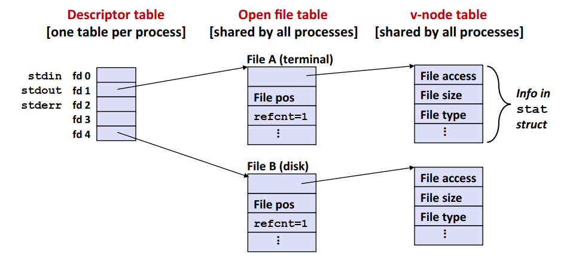
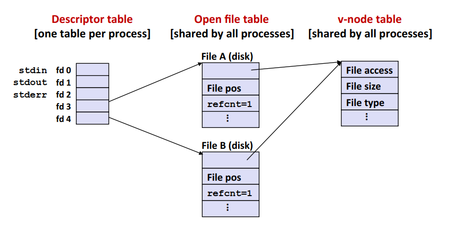
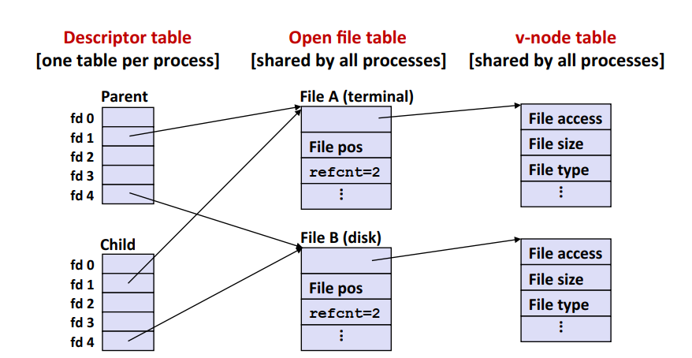
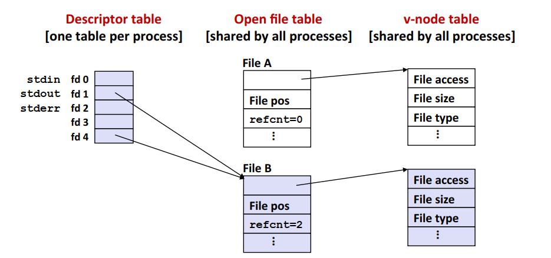

<style> h1 { border-bottom: none } </style>
<style> h2 { border-bottom: none } </style>

<!-- more -->

# 背景

本节是对CSAPP Chapter10内容的整理，同样参考b站课程与书本。
I/O是指在主存和外部设备(包括磁盘、终端、网络)之间复制数据的过程，**输入**是从I/O设备复制数据到主存，**输出**是从主存复制数据到I/O设备。
I/O工具包括内核提供的Unix I/O`read, write`函数，C提供的诸如`printf, scanf`之类的标准库I/O函数，或是用户自定义的I/O函数。

# Unix I/O

Unix的文件可以看成是m个字节的序列，任何I/O设备都会被看成文件。
Linux文件都有一个类型，包括了

* 普通文件：普通文件又可以分为文本文件和二进制文件。其中文本文件是只包含ASCII或Unicode字符的文件，以`\n(0xa)`作为每一行的结束。(Windows以`\r\n(0xd 0xa)`为结束)。
* 目录：目录也是文件！包含一组链接的文件，每个链接将文件名映射到文件。`.`表示当前目录自身的链接，`..`表示当前目录父目录的链接。
* 套接字：与另一个进程网络通信的文件。

## 打开和关闭文件

```C
// 打开文件: 将filename转为文件描述符，并返回描述符数字(未打开的最小描述符)。
// flags: 访问的形式(只读，只写，可读可写)
// mode: 新文件的访问权限
// return：成功则返回文件描述符，失败返回-1(文件不存在或其他)
int open(char * filename, int flags, mode_t mode)

// ------------------------------------------------
// 关闭文件：关闭指定文件描述符的文件
// return: 成功返回0，失败返回-1(如关闭一个已经关闭的描述符)
int close(int fd)
```

在Linux系统中，文件描述符`0, 1, 2`以及被设置为默认的三个值：

* 0：标准输入(stdin)
* 1：标准输出(stdout)
* 2：标准错误(stderr)

## 读和写文件

```C
// return: 成功则为读的字节数，EOF则为0，失败则为-1。
ssize_t read(int fd, void *buf, size_t n);

// return: 成功则为读的字节数，失败则为-1。
ssize_t write(int fd, const void *buf, size_t n);
```

**不足值**是指读和写传送的字节比应用程序要求的少。可能出现的原因包括：

* 读的时候出现了EOF。注意，如果剩余的文件字节数小于要求的字节数，`read`函数会先返回能够读取的最多字节数，下一次`read`时才返回0。
* 从终端读文本行：每个`read`函数传送一个文本行。
* 读和写网络套接字；可能出现由于网络延迟导致的不足

## 其他操作

### 文件元数据

通过`stat`函数能够读取文件的元数据。文件的元数据包括文件的字节数大小`st_size`，文件类型和文件访问许可`st_mode`，以及创建时间、修改时间、访问时间等。

### 读取目录内容

```C
DIR *opendidr(const char *name)
int closedir(DIR *dirp)

// 读取目录，成功则返回一个指向下一目录项的指针，没有则返回NULL
struct dirent *readdir(DIR *dirp)
// 目录项
struct dirent{
    ino_t d_ino; // inode number
    char d_name[256]; // filename
}
```

## 共享文件

要了解Linux的文件组织方式，需要先了解三个概念

* 描述符表：每个进程有独立的描述符表，表示进程打开的文件描述符。
* 打开文件表：所有进程共享。包含文件位置，**引用计数**以及指向v-node的指针，只有引用计数为0的文件表项才会被删除。注意，**同一个文件可能在文件表中有多个条目**。
* v-node表：所有进程共享。每个文件**有且只有一个**表项，为被打开的文件也有。主要信息为`stat`结构包含的信息。



调用两次`open`函数可以在打开文件表中创建两个不同的条目，并由两个不同的文件描述符指向它们，两个文件描述符互相独立。但是打开文件表的两个条目指向同一个v-node表项。


父进程调用`fork`后，子进程会拥有父进程的描述符副本，指向打开文件表中的相同条目，并使其引用计数加一。



重定向操作能够将标准输入输出和文件进行联系。在Shell中，>表示输出重新，<表示输入重定向。如下所示：

```Shell
command > foo.txt // 覆盖的方式把stdout输出到file
command >> foo.txt // 以追加的方式把stdout输出到file
command > foo1.txt 2>foo2.txt // 分别对stdout和stderr进行重定向
command >foo.txt 2>&1 // 将stdout和stderr输出到同一个文件
command >/dev/null // 不保存输出结果
command < foo.txt // 将foo.txt 作为command的输入
```


C语言中可以使用`dup2`函数复制**表项**，从而实现重定向。例如`dup2(4,1)`的结果如下



## 标准I/O库

引入了缓冲区的概念，例如`getc`每次返回文件的下一个字符，而实际上其通过调用底层的`read`来填充缓冲区，减少后续调用`read`的次数。
此外，`scanf`之类的函数是针对文本文件进行读取的，不能将其用来读取二进制文件。


# 总结

不同的I/O实现方式有着不同的优缺点。对于最底层的Unix I/O，其优点在于是异步信号安全的，适合用于信号处理函数中。但是其没有设置缓冲区或者对不足值进行处理，调用的效率较低。
而标准的I/O实现，其处理了不足值并设置了缓冲区，减少了系统调用，从而提高了效率。但是其不是异步信号安全的；此外其不能很好的处理网络通信过程中的I/O读写。
实际操作中，需要根据需求，基于Unix I/O设计符合要求的I/O函数。

