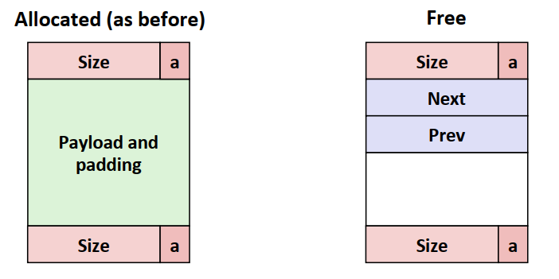

<style> h1 { border-bottom: none } </style>
<style> h2 { border-bottom: none } </style>

<!-- more -->

# 背景

本节是对CSAPP Chapter9内容的整理，同样参考b站课程与书本。

## 为什么需要虚拟内存？

1. 主存资源相比于磁盘来说是稀缺的。虚拟内存将主存看成磁盘的缓存，只存储必要的数据。
2. 进程之间的地址内容应该是互相隔离的。而虚拟内存为每个进程提供了一致的地址空间，简化了内存管理。也避免了进程间地址的相互破坏。

# 虚拟内存

CPU给出虚拟地址后，由硬件**内存管理单元(MMU)**根据主存中的表查询并翻译得到物理地址，并从主存中获取数据。
因此，在系统中包括了虚拟地址和物理地址。虚拟地址的地址空间为`N = 2^n`，物理地址的地址空间为`M`。一般情况下`N > M`。

## 虚拟内存作为缓存

**虚拟内存**是位于**磁盘**上的N个连续的字节组成的数组，其中的数据被分割成**页**，大小为`P=2^P`。一般来说，虚拟页可以分为三种:

* 未分配的: 未分配的页不需要占用任何磁盘空间
* 缓存的：已经缓存在物理内存中的已分配页
* 未缓存的：未缓存在物理内存中的已分配页

为了判断虚拟页的缓存情况，在物理内存中的**页表**负责将虚拟页映射到物理页。MMU只负责根据页表进行地址转换，页表的更新和数据传送时由操作系统维护的。下图为虚拟内存的示意图,可以看出在页表中有一个有效位表示该页是否**被缓存**，如果被缓存，则地址指向主存中的物理页的起始位置，若未缓存但已分配则指向磁盘中的起始位置。


### 页命中

如果页命中，如同其他的缓存结构一样，MTU通过页表得到这一页的物理地址。

### 缺页

缺页会导致一个缺页异常，并调用内核中的缺页异常处理程序进行处理。缺页处理程序选择牺牲页驱逐后将对应页复制到物理内存中，并从异常处理程序返回。
从异常处理程序返回后，程序重新执行导致缺页的指令。这是Chapter 8中的异常类型中故障的一个典型应用场景。

## 虚拟内存作为内存管理

**每个进程都有一个独立的页表**，这个页表位于进程的上下文信息中。

### 虚拟内存简化内存分配

调用诸如`malloc`之类的函数分配空间时，会分配连续的虚拟内存页面，但在物理内存中的页面是不需要连续的。

### 虚拟内存简化共享

可以将多个进程的不同虚拟页面映射到相同的物理页面，例如`printf`，避免了这些代码在每个进程中都要有自己副本的问题，节省了内存空间。

### 虚拟内存简化链接和加载

在链接时，虚拟内存的存在使得链接器在重定位时能够生成独立于最终物理内存位置的可执行文件，大大简化了链接器的实现。
在加载时，虚拟内存的存在使得**加载器不需要从磁盘到内存复制任何数据**，只需要在每个页初次被引用时再执行复制即可。

## 虚拟内存作为内存保护

可以在每个页表条目(PTE)上添加一些额外的保护位进行权限控制。
MMU在地址翻译时会检查相应的地址位，若发生了不合法的操作会触发一个故障，从而调用异常处理程序。


# 地址翻译

使用页表的地址翻译示意图如下，物理地址为m位，虚拟地址为n位，后面的p位为页内的数据偏移(VPO/PPO)，前面的则为页的索引数(VPN/PPN)。由于物理页面和虚拟页面都是`P`字节，因此`VPO = PPO`。页表基址寄存器中存放了当前进程页表的基址地址。


## 结合缓存

结合缓存的示意图如下，其中有几个细节：

* 图中的`PTEA`和`PA`都是以**物理地址**的形式给到缓存和主存中。
* 缓存中的数据块查找是根据**物理地址**完成的。 
* **内存是全相联的**，即所有虚拟页可以放在任何物理页中，采用的是写回策略，从而减少磁盘读取和写入的处罚。
* **MMU中**可能还包含一个自己的PTE缓存,**TLB**。MMU通过TLB以VPN为输入，得到相应的PTE，并翻译得到物理地址。如果TLB不命中则需要从L1缓存或主存中获取PTE。


## 多级页表

假设虚拟地址是48位，每个PTE有8字节，页的大小为4KB，则页表所需空间为$512GB$，这显然是不现实的，因此需要用多级页表解决。

$$
2^{48} \times 2^{-12} \times 2^3 = 2^38 = 512G
$$

多级页表的示意图如下，其中有几个细节：
* 只有一级页面是一直存在于主存中的，后面的可能存在磁盘中。
* 如果一级页表对应的PTE是空的，相应的二级页表不存在，从而节约了空间。


多级页表的地址翻译如下：


## 实例1：简单的例子

下面为书上和课件上的一个例子，是对前面内容的一个综合整理

虚拟地址和物理地址的格式如下:


TLB共包含16条缓存内容，是4路相联缓存


页表条目中前16个PTE如下


L1缓存是直接映射的，共有16个组，每个数据块为4个字节。缓存块的前16条内容如下


假设想要读取`0x03d4`的指令(1字节)，对VPN翻译如下

`TLBT=0x03, TLBI=0x3`，缓存命中，`PPN=0x0d`,故得到物理地址

根据物理地址，在缓存中组索引`CI=0x5`,标志`CT=0x0D`，偏移`CO=0`，故缓存命中，此时返回数据`0x36`。

## 实例2：Linux内存系统

### 整体架构

系统的地址翻译图如下，系统中的虚拟地址为48位，物理地址为52位。共采用了四级页表，每级页表由VPN中的9位地址进行翻译。
系统中PPO的12位刚好构成了缓存索引中的组索引和偏移，而PPO=VPO。因此在地址翻译时，VPN被发送到MMU，而VPO会事先被发送到缓存中进行查找，从而提高效率。


多级页表中的PTE示意图如下，每个PTE大小为8个字节(64位)。最上方为第一-三级的PTE示意，中间为第四级页表的PTE示意(P=1)，下方为子页表在磁盘时的示意图(P=0)。
条目除了包含**40位的页表物理基地址**以外，还包含了**权限位**控制对页的访问, 写策略，页面大小等参数。**引用位A**则是MMU每次访问一个页时进行设置，辅助实现页替换算法。**修改位D**同样由MMU在页面进行写之后设置，已告诉内核是否需要写回牺牲页。


### 虚拟内存系统

一个进程虚拟内存的示意图如下，系统将一些已分配的连续的虚拟内存页面组织成各个**区域(段)**，例如

* 各个进程的上下文信息，如页表,PID,栈指针，程序计数器
* 所有进程共享的代码和数据信息
* 用户栈：从高向低，栈顶在低地址
* 共享库的内存映射区域
* 运行时的堆，往上增长
* .bss,.data,.text


虚拟内存工作时需要一个`mm_struct`的结构，其有两个字段。`pgd`指向第一级页表的基址，`mmap`指向一个描述区域的链表，包含了区域的开始和结束地址，区域内所有页的读取权限，共享情况等信息。
MMU在进行地址翻译的过程中，可能出现的缺页情况包括：

* 虚拟地址是否合法。此时内核的缺页处理程序需要比较虚拟地址是否位于每个区域内
* 内存访问是否合法。此时内核的缺页处理程序需要判断权限，如果不合法会终止进程。
* 正常的缺页。此时内核的缺页处理程序会选择牺牲页进行交换并更新页表，并返回引起缺页的指令。
  


## 内存映射

**内存映射**是指将虚拟内存区域与磁盘中的对象关联起来，从而初始化虚拟内存区域的过程。映射对象包括：1) Linux系统的普通文件，只有在CPU引用该页面的时候才会发生数据传送。2) 内核创建的全部为0的匿名文件。当CPU引用这一虚拟页面时，内核会直接在物理内存中找到合适的牺牲页面进行覆盖，此时**不需要磁盘和内存之间的数据传送**。
内核维护一个专门的**交换空间**，保留内存中的牺牲页。
**共享对象**是指进程对对象的任何操作，其他进程都是可见的，而且会反映在磁盘上的原始对象中。多个进程的共享对象在物理内存中只需要一个副本。
**私有对象**则与共享对象相反，并且采用**写时复制**的方法进行映射。如下图所示，私有区域中的页表条目被设为已读，区域结构设置为写时复制。如果没有进程尝试写，则两者共享一个副本，当有进程尝试写该区域时，会触发一个故障。故障处理程序根据故障，在物理内存中**创建该页面的副本，更新页表条目**，这是函数`fork`的基本原理。


`mmap`函数可以进行用户级的内存映射。其将文件描述符`fd`指定的对象的连续的片映射到新的区域，大小为`length`字节。 

```C
void *mmap(void *start, size_t length, int prot, int flags, int fd, off_t offset);
```

# 动态内存分配

**动态内存分配器**可以帮助程序在运行时获取虚拟内存，借助于虚拟内存中的**堆**完成。堆位于`.bss`区域的上方，向更高的地址生长。内核维护变量`brk`指向堆的顶部。
分配器在进行维护时，基于**块**的概念进行维护。不同的块具有不同的大小，但都是连续的虚拟内存片。块的状态分为已分配的和空闲的。
分配器可以分为显式分配器和隐式分配器

* 显式分配器：诸如C这样在分配后需要显式的进行释放块。在C中的函数是`malloc`和`free`。
* 隐式分配器：分配器自己检测一个已分配块何时不再使用，并负责对其进行释放。

```C
// 若分配成功，返回已分配块的指针，出错则返回NULL
// 一般需要转换为所需要的类型
void *malloc(size_t size); 

// ptr需要指向一个从malloc获得的指针，否则可能会出现问题
void *free(void * ptr);
```

## 分配器的要求和目标

分配器需要满足以下要求：

* 立即相应请求：不能缓冲或者重新排列请求。
* 只能使用堆的空间，只能操作或分配空闲块。
* 不能修改已经分配的块。**一旦块被分配，就不允许修改或者移动**。
* 可能有地址的对齐要求。

分配器的目标权衡。时间和空间的两个目标常常是冲突的。

* 时间效率：**吞吐量**。每秒能够完成的操作数。
* 空间效率：**峰值利用率**。定义有效载荷为请求的字节大小，聚集有效载荷为已分配块的有效载荷之和$P_k$，$H_k$表示当前堆的大小，则峰值利用率为。注意这里可能会有释放请求，因此有效载荷不一定是单增的。

$$
U_k = \frac{max_{i\le k P_i}}{H_k}
$$

理想情况下，空间的利用率应该为1，但**碎片**的存在造成了利用率的降低。
内部碎片是指有效载荷小于块大小的情况，可能出现的原因包括：1) 分配器保留的信息带来的额外开销。2) 对齐要求。3) 块最小容量的限制。当请求序列和分配器策略确定后，内部碎片是确定的。
外部碎片是指块之间的空隙之和满足分配请求，但是没有单独的块能够容纳这一请求。是否有外部碎片实际上是取决于**将来的请求**。

## 分配器的实现

分配器的实现需要考虑如下几个问题

* 组织：如何知道块的大小，如何记录空闲块
* 放置：如何选择合适的空闲块
* 分割：将某个空闲块分配后，如何处理剩余的部分
* 合并：如何处理被释放的块

## 隐式空闲列表

### 问题1

为了区分边界以及是否为空闲块，维护如下的数据结构。其中块包含一个字(4个字节,32位)的头部。头部包含的信息有**块大小(包含头部本身以及填充)**，**是否分配的标志位**。假设有一个双字(8字节)对齐的约束条件，那么块大小的低三位总是为0，可用来做标志位。


如下为隐式空闲列表的示意图(每一块为4个字节)，由于`malloc`返回的地址是有效载荷开始的地址，是8字节对齐的，因此最开始有4个字节的偏移。最后有大小为0的结束块标志。


### 问题2

放置的方式主要有首次适配、下一次适配、最佳适配。这些方法的时间复杂度大都与堆当中块的数量级相同。(下面为首次适配的代码)

```C
p = start;
while((p < end) && ((*p & 1) || (*p <= len))) // 未分配，大小符合要求
{
    p = p + (*p & -2) // 去除标志位后得到块大小
}
```

### 问题3

最简单的方法是不进行分割，但是这可能会带来较多的内部碎片。进行分割的代码如下

```C
void addblock(ptr p, int len){
    int newsize = ((len + 1) >> 1) << 1;
    int oldsize = *p & -2; // -2 = 0x111111111111110
    *p = newsize | 1 // 最后一位置为1
    if(newsize < oldsize){
        *(p + newsize) = oldsize - newsize;
    }
}
```

### 问题4

当释放一个新的内存块后，应该遵循的原则是**不要有连续的空闲块**,因此需要完成空闲块的合并。合并包括立即合并和推迟合并。
合并后面的块可以直接根据块大小确定并完成，但是合并前面的块需要借助额外的标记。即在块的最后面加上一个与头部相同的脚部。


上述的方案会带来两个字的额外开销，可以进行进一步优化。如果前一个块是空闲的时候才需要脚部进行判断，因此对于已分配块的脚部也可也用来当有效载荷。但此时需要将前面的块的分配信息存放于当前块的标志位中。

## 显式空闲链表

隐式空闲链表的问题在于块分配与块的总数呈线性关系。为了进一步提升时间效率，可以将空闲块单独组成双向链表。此时块的结构如下：



注意，双向链表中的`prev`和`next`不一定就是虚拟内存中的前一内存块和后一内存块。此外，已分配的内存块的结构跟隐式空闲链表完全相同。

### 问题2

此时分配的时间从块总数的线性时间减少到了**空闲块数量**的线性时间。

### 问题3

与隐式空闲链表相同。

### 问题4

释放一个新的内存块可以有不同的策略，一种策略是LIFO策略，即将新释放的块放在链表的开始，时间复杂度为`O(1)`。另一种策略是按照地址顺序维护，时间复杂度为`O(N)`。以LIFO为例，如下为前后都为空闲块情况下的释放与合并


显式空闲链表引入了更多的内部碎片。但是在分配的时间效率上要好于隐式空闲链表。

## 分离空闲链表

核心思想是维护多个空闲链表，每个链表中的块有着接近的大小。分配时按照所需的块大小在相应的空闲链表进行搜索，分割后可能需要**更新剩余块**所在的链表。
分离空闲链表的优点在于时间效率较高，`log(n)`的分配效率。空间利用率也较高，对于分离空闲链表使用首次分配的空间利用率约等于在整个堆中使用最佳适配。

## 垃圾收集

核心思想是对于内存中没有指针指向的块，将其进行自动的回收。但是C语言在使用垃圾收集中存在着以下问题：

* 无法辨别一个变量是否是指针以及其是否有效
* 如何通过指针获取一个块的起始位置

### Mark & Sweep算法

Mark&Sweep算法使用有向图描述内存中的块。其中根节点为寄存器、栈中的局部变量以及数据区的全局变量吗，堆节点对应于堆中的一个**已分配块**。节点是可达的是指从任意根节点出发有有向路径到达该节点，不可达的节点称为垃圾。


在Mark阶段，算法使用DFS遍历所有的块，查看其是否可达。可达的块会被设置一个额外的标志位。在Sweep阶段，顺序遍历所有块，将不可达的块进行释放。


而对于上述的两个问题，第一个问题在C语言中会采取保守的策略，这可能导致某些变量被当成指针，其又恰好指向某些内存块，从而使得部分内存块被错误的保留。
第二个问题可以将已分配的块维护成二叉平衡树，左子树的块的地址要小于右子树。并根据指针的地址来查找其所在的块。